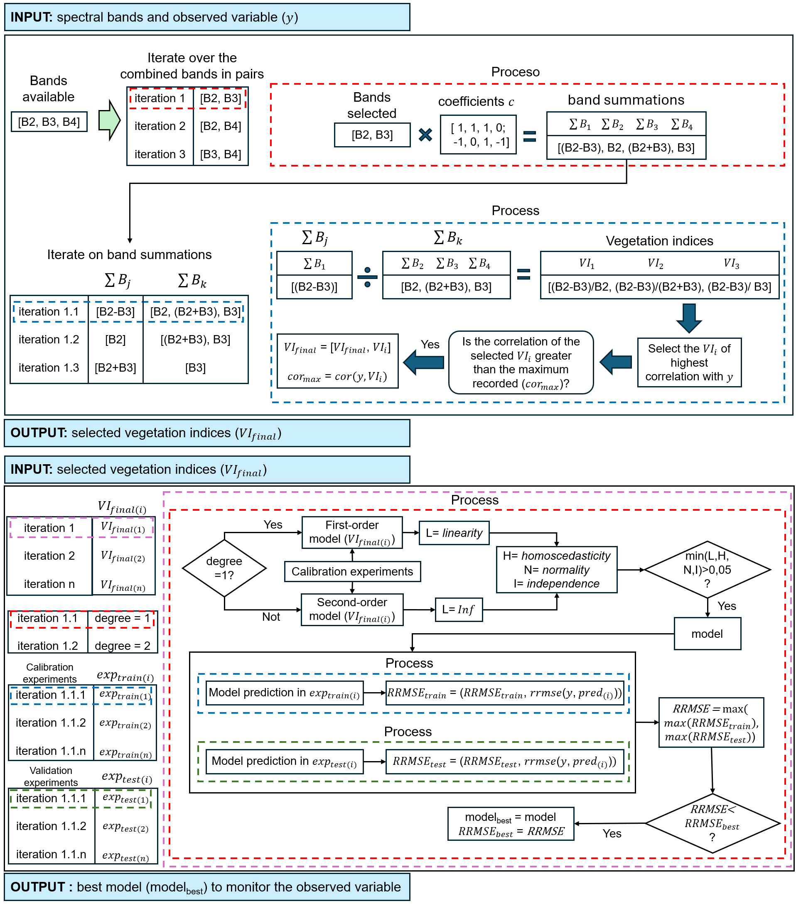
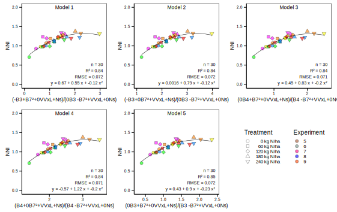
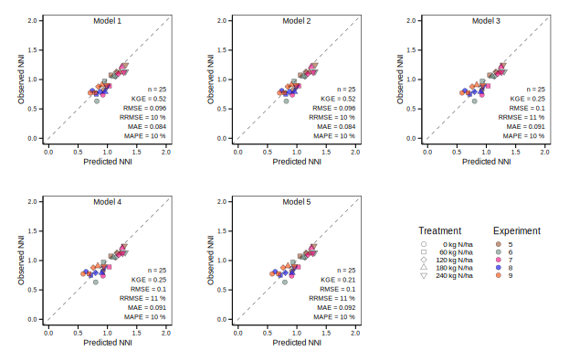

<!-- README.md is generated from README.Rmd. Please edit that file -->

```{r, include = FALSE}
knitr::opts_chunk$set(
  collapse = TRUE,
  comment = "#>",
  fig.path = "man/figures/README-",
  out.width = "100%"
)
```

# SPARK: Crop monitoring algorithm

<!-- badges: start -->
[](https://github.com/adrianlapaz3/SPARK/actions/workflows/R-CMD-check.yaml)
[](https://opensource.org/licenses/MIT)
<!-- badges: end -->

**SPARK** is an algorithm developed specifically for crop monitoring. Its main function is to calculate vegetation indices based on the observed variables by combining spectral bands and applying data fusion techniques within a linear model. By integrating both spectral band combinations and data fusion techniques, SPARK enables the creation of vegetation indices that are specifically tailored to the observed variable. The algorithm generates explanatory linear models that provide a clearer understanding of the monitoring results obtained from remote sensing instruments in relation to the observed variable.  

**SPARK::maize** is equipped with average data per treatment experiment for above-ground biomass (AGB), nitrogen uptake (Nuptake), and nitrogen nutrition index (NNI). It also contains spectral bands from Sentinel-2 (B2, B3, B4, B5, B6, B7, B8, B8A, B11 and B12), C-SAR backscatter data from Sentinel-1 (VH, VV, VHxL, VVxL, in absolute values and divided by 100 and 1000), and nitrogen in soil to a depth of 60 cm (Ns) at sowing for eleven experiments on nitrogen fertilization of maize (Treatment: 0N, 60N, 120N, 180N, 240N). These experiments were conducted at growth stages up to the sixth, tenth, and fourteenth fully developed leaf and flowering stages ($V_{6}$, $V_{10}$, $V_{14}$, and $R_{1}$, respectively). The experiments were conducted in different management zones (MZ) within four commercial production sites (Site) in two contrasting regions of the Argentine Pampas (North and Southeast).

## Brief overview of how SPARK works
#### Combining Bands
In the virtual environment of R (version 4.2.3), the vegetation indices are developed by combining bands for each stage, similar to previous work ([Dusek et al., 1985](#ref-Dusek1985); [Xie et al., 2014](#ref-Xie2014)). This method does not assume specific bands or vegetation indices. Instead, the combinations of bands are evaluated in a mathematical formula:
$VI_i = \frac{\sum B_j \times c}{\sum B_k \times c}$
where $VI_i$ is a vegetation index, $B_j$ and $B_k$ are the different groups of evaluated bands and $c$ are the coefficients -1, 0 and 1.

In this procedure, the bands are iterated, combined with each other, and the result of the equation is evaluated with the observed variable ([Figure 1](#fig-Figure1)). At each iteration, the correlation (Pearson coefficient) between the value of the equation with the evaluated bands and the observed variable is evaluated. When the correlation of the evaluated vegetation index ($VI_i$ in [Figure 1](#fig-Figure1)) is higher than the best value of the previous iterations, it is added to the matrix of selected indices ($VI_{final}$ in [Figure 1](#fig-Figure1)). In this way, the indices with the highest correlation with the observed variable are determined from the evaluated combinations.

The selected indices are then evaluated with the observed variable in first- and second-order linear models. The indices that generate models that meet the assumptions of linearity, homoscedasticity, independence and normality of the residuals are evaluated based on the prediction error obtained in each calibration and validation experiment (see [Figure 1](#fig-Figure1)). The index with the lowest prediction error is selected for the final model (see example in [Figure 2](#fig-Figure2) and [Figure 3](#fig-Figure3)).

  
  
<a id="fig-Figure1"></a>**Figure 1** The development process of the SPARK algorithm and shows the iteration over bands, their combinations, and the selection of vegetation indices using three available bands. The letters B represent the bands in the blue (B2), green (B3), and red (B4) spectrum of Sentinel-2. The nomenclature $VI_i$ corresponds to a vegetation index, $VI_{final}$ is the matrix of the selected vegetation indices, $\sum B_j$ and $\sum B_k$ are sums of the bands, $cor$ is a function that evaluates the correlation between two variables, $cor_{max}$ is the maximum recorded correlation, $exp_{trian(i)}$ and $exp_{test(i)}$ are the evaluated calibration and validation experiments, $RRMSE_{trian}$ and $RRMSE_{test}$ are the errors of the individual evaluated calibration and validation experiments, and $RRMSE_{best}$ is the error of the best model found ($model_{best}$).  
  
[Figure 1](#fig-Figure1) shows how vegetation indices created from combinations of three bands are evaluated. An adequate representation of a multidimensional spectral space for scenes with vegetation is usually achieved with an optimal set of spectral data ("intrinsic dimensionality"). The use of more than four bands generally does not improve the information content of the study ([Swain and Davis, 1978, cited in Korobov and Railyan, 1993](#ref-Korobov1993)). Therefore, a maximum of four bands per constructed index is correct. However, other studies have used combinations of up to seven bands ([Dusek et al., 1985](#ref-Dusek1985)), so that up to five bands per index can be analyzed if necessary.


#### Data Fusion
The vegetation indices are calculated using the spectral bands (e.g., B2, B3, B4, B5, B6, B7, B8, B8A, B11 and B12 for Sentinel-2). For the data fusion, these bands are merged with the nitrogen soil (Ns) and the radar backscatter, such as the C-SAR backscatter of Sentinel-1, uncorrected or corrected for the local angle of incidence (VHxL and VVxL). For example, the VH and VV backscatter values in absolute decibel values are divided by 100 and the VHxL and VVxL values in absolute values are divided by 1,000. This step normalizes the VH and VV values between 0 and 1, similar to the scale of the Sentinel-2 spectral bands. In addition, both the spectral bands and the normalized backscatter values can be evaluated quadratically.

#### Metrics Used to Select Models

The metrics used by the algorithm to select the models are root mean square error (RMSE), relative root mean square error (RRMSE), mean absolute error (MAE), mean absolute percentage error (MAPE), and Kling-Gupta Model Efficiency (KGE) ([Kling et al., 2012](#ref-Kling2012); [Correndo et al., 2022](#ref-Correndo2022)).

*Root Mean Square Error (RMSE)*  
$$
RMSE = \sqrt{\frac{1}{n} \sum_{i=1}^{n} (pred_i - obs_i)^2}
$$

*Relative Root Mean Square Error (RRMSE)*  
$$
RRMSE = \frac{\sqrt{\frac{1}{n} \sum_{i=1}^{n} (pred_i - obs_i)^2}}{\frac{1}{n} \sum_{i=1}^{n} obs_i} \times 100
$$

*Mean Absolute Error (MAE)*  
$$
MAE = \frac{1}{n} \sum_{i=1}^{n} |pred_i - obs_i|
$$

*Mean Absolute Percentage Error (MAPE)*  
$$
MAPE = \frac{1}{n} \sum_{i=1}^{n} \left| \frac{obs_i - pred_i}{obs_i} \right| \times 100
$$

*Kling-Gupta Model Efficiency (KGE)*  
$$
KGE' = 1 - \sqrt{(r - 1)^2 + (\gamma - 1)^2 + (\beta - 1)^2}
$$

Where:  

- $r$ is the Pearson correlation coefficient between predictions and observations.
The Pearson correlation coefficient ($r$) is calculated as:  
$$
r = \frac{\sum_{i=1}^{n} (pred_i - \mu_{pred})(obs_i - \mu_{obs})}{\sqrt{\sum_{i=1}^{n} (pred_i - \mu_{pred})^2 \sum_{i=1}^{n} (obs_i - \mu_{obs})^2}}
$$

- $\beta$ is the ratio between the mean of the predictions ($\mu_{pred}$) and the mean of the observations ($\mu_{obs}$).  

$$
\beta = \frac{\mu_{pred}}{\mu_{obs}}
$$

- $\gamma$ is the ratio between the standard deviation of the predictions ($\sigma_{pred}$) over their mean ($\mu_{pred}$) and the standard deviation of the observations ($\sigma_{obs}$) over their mean ($\mu_{obs}$).  

$$
\gamma = \frac{\frac{\sigma_{pred}}{\mu_{pred}}}{\frac{\sigma_{obs}}{\mu_{obs}}}
$$
Where:
- $\sigma_{pred}$ is calculated as ($\sqrt{\frac{1}{n} \sum_{i=1}^{n} (pred_i - \mu_{pred})^2}$)  
- $\sigma_{obs}$ is calculated as ($\sqrt{\frac{1}{n} \sum_{i=1}^{n} (obs_i - \mu_{obs})^2}$)  

## SPARK package and use
#### Installation

You can install the development version of SPARK from [GitHub](https://github.com/) with:

``` r
# install.packages("devtools")
devtools::install_github("adrianlapaz3/SPARK")
```
#### Librearies necesaries
```{r packages, eval=FALSE}
install.packages(lmtest)
install.packages(nortest)
install.packages(orcutt)
install.packages(ggplot2)
install.packages(paletteer)
install.packages(gridExtra)
install.packages(egg)
install.packages(svglite)
```

#### Functions and data from SPARK
The SPARK package in R combines spectral bands and data fusion for modeling vegetation indices with linear models. The functions *optical_indices()*, *optical_Ns_indices()*, *optical_SAR_indices()*, and *optical_SAR_Ns_indices()* create vegetation indices by combining different spectral bands and data fusion. The linear_model function fits linear models to these vegetation indices, allowing the relationship between the indices and the observed variables to be evaluated. For visualization, the *model_plot()* function stores plots as the shape of the five best models on the train and test data.

##### Loading the SPARK package
```{r SPARK, eval=FALSE}
library(SPARK)
```

##### Maize data
```{r data}
data = SPARK::maize
head(data.frame(data), 5)
```

##### Combining spectral bands with the *optical_indices()* function
```{r optical_indices, eval=FALSE}
optical_indices(
  data = ,          # dataset          
  y = ,             # observed variable
  n_bands = ,       # number of bands in vegetation indices
  set_bands = ,     # names of spectral bands
  scan =            # to increase selected vegetation indices (0.95-1)
)
```
**Attention**
*set_bands* for the bands squared, e.g. B2$^{2}$, input as "B2_2"
*Scan* increases the number of selected vegetation indices, as each time the best correlation is saved, it is multiplied by scan. A lower scan value results in more vegetation indices, but this can also increase the execution time and generate too many vegetation indices. It is recommended to increase the scan value from 0.85 to 1, although higher values (around 0.95-1) should be used if there are many bands.

##### Data fusion with spectral bands and radar soil nitrogen (Ns) with the *optical_Ns_indices()* function
```{r optical_Ns_indices, eval=FALSE}
optical_Ns_indices(
  data = ,          # dataset          
  y = ,             # observed variable
  n_bands = ,       # number of bands in vegetation indices 
  set_bands = ,     # names of spectral bands and Ns
  scan =            # to increase selected vegetation indices (0.95-1)
)
```
**Attention**
*set_bands* and col names when use of the bands squared, e.g. B2$^{2}$ and Ns$^{2}$, input as "B2_2" and "Ns_2". Furthermore, for Ns or other variables, e.g. lidar, use col name as "Ns"
*Scan* increases the number of selected vegetation indices, as each time the best correlation is saved, it is multiplied by scan. A lower scan value results in more vegetation indices, but this can also increase the execution time and generate too many vegetation indices. It is recommended to increase the scan value from 0.85 to 1, although higher values (around 0.95-1) should be used if there are many bands.

##### Data fusion with spectral bands and radar (SAR) and soil nitrogen (Ns) with the *optical_SAR_indices()* function
```{r optical_SAR_indices, eval=FALSE}
optical_SAR_indices(
  data = ,          # dataset          
  y = ,             # observed variable
  n_bands = ,       # number of bands in vegetation indices 
  set_bands = ,     # names of spectral bands and C-SAR backscatters 
  scan =            # to increase selected vegetation indices (0.95-1)
)
```
**Attention**
*set_bands* and col names when use of the bands squared, e.g. B2$^{2}$ and VH$^{2}$, input as "B2_2" and "VH_2".
*Scan* increases the number of selected vegetation indices, as each time the best correlation is saved, it is multiplied by scan. A lower scan value results in more vegetation indices, but this can also increase the execution time and generate too many vegetation indices. It is recommended to increase the scan value from 0.85 to 1, although higher values (around 0.95-1) should be used if there are many bands.

##### Data fusion with spectral bands and radar (SAR), soil nitrogen (Ns) with the *optical_SAR_Ns_indices()* function 
```{r optical_SAR_Ns_indices, eval=FALSE}
optical_SAR_Ns_indices(
  data = ,          # dataset          
  y = ,             # observed variable
  n_bands = ,       # number of bands in vegetation indices 
  set_bands = ,     # names of spectral bands, C-SAR backscatters, and Ns 
  scan =            # to increase selected vegetation indices (0.95-1)
)
```
*set_bands* and col names when use of the bands squared, e.g. B2$^{2}$, Ns$^{2}$, and VH$^{2}$, input as "B2_2", "VH_2", and "Ns_2". Furthermore, for Ns or other variables, e.g. lidar, use col name as "Ns"

##### Modeling selected vegetation indices with the *linear_model()* function
```{r linear_model, eval=FALSE}
linear_model(
  VIs = ,           # selected vegetation indices
  y = ,             # observed variable
  experiment = ,    # variable with_number experiments,
  treatment = ,     # variable with treatment as factor,
  train_exp = c(),     # vector with experiment numbers for train model,  
  test_exp =  c(),      # vector with experiment numbers for test model,  
  model_degree = ,  # degree of model (1 or 2),
  metric = ,        # metric for selecting models, these are RRMSE (put "RRMSE" or "rmse"), MAPE (put "MAPE" or "mape"), and KGE (put "KGE" or "kge")
  orcutt = ,        # to readjust model parameters if there is dependence (1 for true, 0 for false)
  cook_distance = , # to eliminate outliers during modeling (1 for true, 0 for false)
)
```

##### Ploting the top five models with vegetation indices for monitoring observed variable using *model_plot()* function
```{r model_plot, eval=FALSE}
model_plot(
  models = , # put the top five models from output linear_model()               
  treatments = c(), # Vector indicating the sequence of treatment breaks, e.g. c("0N", "60N", "120N", "180N", "240N")
  lables_treat = c(), #Vector indicating the sequence of labels treatment breaks, e.g. c("0 kg N/ha", "60 kg N/ha", "120 kg N/ha", "180 kg N/ha", "240 kg N/ha")
  shape = c(), # Vector that specifies the order of the shapes for the treatment breaks in the legend, e.g. c(21, 22, 23, 24, 25)
  y_breaks = , # Number of breaks for the observable variable (y-axis) in the diagram, e.g. 5 for a range from 0 to 1, with the axis points marked at 0, 0.2, 0.4, 0.6, 0.8 and 1
  min_y_lim = , # Minimum limit for the axis of the observable variable (y-axis) in the diagram, e.g. 0
  max_y_lim = , # Maximum limit for the axis of the observable variable (y-axis) in the diagram, e.g. 1
  directory =   # Put a directory for the example, e.g."C:/Users/User/Downloads"
)
```

#### Results
The results are saved in the computer as .svg, so it is necessary to enter the link of the directory and the train ([Figure 2](#fig-Figure2)) and test ([Figure 3](#fig-Figure3)) models there.  
  
**Example of the output for Train models selected**  
  
  
<a id="fig-Figure2"></a>**Figure 2** The five best models selected for monitoring the nitrogen-nutrient index (NNI) in maize data fusion vegetation indices (optical_SAR_Ns_indices) at the stage of the tenth leaf of the crop maize expanded. The letters B correspond to the blue (B2), green (B3), red (B4), red edge (B5, B6, B7), near-infrared (B8, B8A) and shortwave infrared (B11, B12) bands of the Sentinel-2 spectrum. VH (vertical-horizontal) and VV (vertical-vertical) are the Sentinel-1 C-SAR backscatter values in absolute decibels divided by 100, between 0 and 1. In addition, VVxL and VHxL represent the VV and VH backscatter values multiplied by the local incidence angle in degrees (LIA) and divided by 1,000 in absolute values between 0 and 1. Ns stands for the soil nitrogen in kg ha$^{-1}$ for the soil nitrogen ($NO_{3}^{-}$-N) at a depth of 60 cm divided by 1,000, also in the range from 0 to 1.  
  
The preceding number **0** means that this band is not used for the calculation of the vegetation index at this point, e.g. (B8+0B3-B4)/(B8+B3+B4), correctly written this is (B8-B4)/(B8+B3+B4).


**Example of the output for Test models selected**    
  
  
<a id="fig-Figure3"></a>**Figure 3** Test The five best models selected for monitoring the nitrogen-nutrient index (NNI) in maize data fusion vegetation indices (optical_SAR_Ns_indices) at the stage of the tenth leaf of the crop maize expanded.RMSE: Root Mean Square Error. RRMSE: RMSE relative to the observed mean. MAE: Mean absolute error. MAPE: Mean absolute percentage error. The errors represent the average of the five experiments.

#### Example

This is a basic example which shows you how to solve a common problem:  
**Attention**
The results in this example appear incorrectly formatted. The final results should look like those in [Figure 2](#fig-Figure2) and test [Figure 3](#fig-Figure3).
```{r example}
library(SPARK)

# Example dataset included in the SPARK package
maize_data <- SPARK::maize

# Filter the data for a specific stage
V10 <- maize_data[maize_data$Stage == "V10", ]

# Define the spectral bands to be used
bands_names <- c("B3", "B4", "B5", "B6", "B8", "B7_2", "B11_2", "VH",  "VVxL", "Ns")

# Combine spectral bands to create vegetation indices
NNI_V10_VIs <- optical_SAR_Ns_indices(
  data = V10, 
  y = V10["NNI"], 
  n_bands = 4, 
  set_bands = bands_names, 
  scan = 0.995
)

# Model vegetation indices with linear models
NNI_V10_model <- linear_model(
  VIs = NNI_V10_VIs,
  y = V10["NNI"],
  experiment = V10["Experiment"], 
  treatment = V10["Treatment"],
  train_exp = c(1, 2, 3, 4, 10, 11),   
  test_exp = c(5, 6, 7, 8, 9),  
  model_degree = 2,
  metric = "kge",
  orcutt = 1, 
  cook_distance = 0
)

# Plot the results
model_plot(
  models = NNI_V10_model,                       
  treatments = c("0N", "60N", "120N", "180N", "240N"),
  lables_treat = c("  0 kg N/ha", " 60 kg N/ha", "120 kg N/ha", "180 kg N/ha", "240 kg N/ha"),
  shape = c(21, 22, 23, 24, 25),
  y_breaks = 5,
  min_y_lim = 0,
  max_y_lim = 2,
  directory = tempdir()  # Put a directory for the example
)

```

## References
- <a id="ref-Dusek1985"></a>Dusek, D.A., Jackson, R.D., Musick, J.T. (1985). Winter wheat vegetation indices calculated from combinations of seven spectral bands. Remote Sensing of Environment, 18(3), 255-267. https://doi.org/10.1016/0034-4257(85)90061-6
- <a id="ref-Correndo2022"></a>Correndo, A.A., Rosso, L.H.M., Hernandez, C.H., Bastos, L.M., Nieto, L., Holzworth, D., Ciampitti, I.A. (2022). metrica: an R package to evaluate prediction performance of regression and classification point-forecast models. Journal of Open Source Software, 7(79), 4655. https://doi.org/10.21105/joss.04655
- <a id="ref-Kling2012"></a>Kling, H., Fuchs, M., & Paulin, M. (2012). Runoff conditions in the upper Danube basin under an ensemble of climate change scenarios. Journal of Hydrology, 424, 264-277. https://doi.org/10.1016/j.jhydrol.2012.01.011
- <a id="ref-Korobov1993"></a>Korobov, R. M., & Railyan, V. Y. (1993). Canonical correlation relationships among spectral and phytometric variables for twenty winter wheat fields. Remote Sensing of Environment, 43(1), 1-10. https://doi.org/10.1016/0034-4257(93)90059-7
- <a id="ref-Xie2014"></a>Xie, Q., Huang, W., Liang, D., Chen, P., Wu, C., Yang, G., Zhang, J., Huang, L., Zhang, D. (2014). Leaf area index estimation using vegetation indices derived from airborne hyperspectral images in winter wheat. IEEE Journal of Selected Topics in Applied Earth Observations and Remote Sensing, 7(8), 3586-3594. https://doi.org/10.1109/JSTARS.2014.2342291
