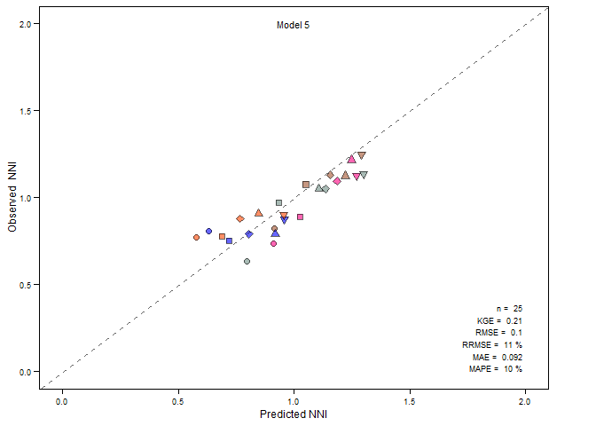
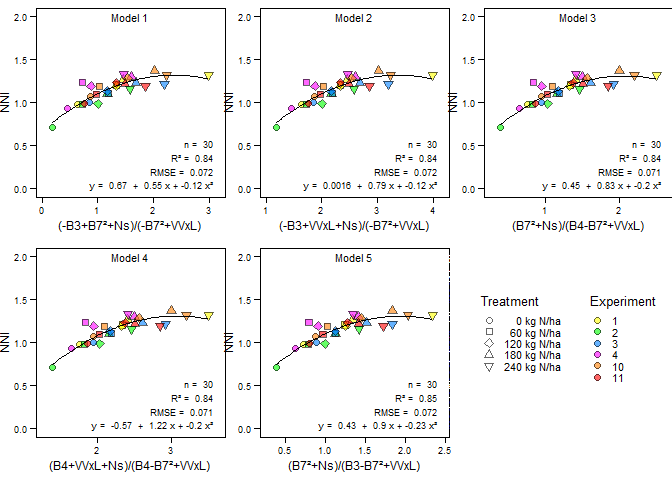
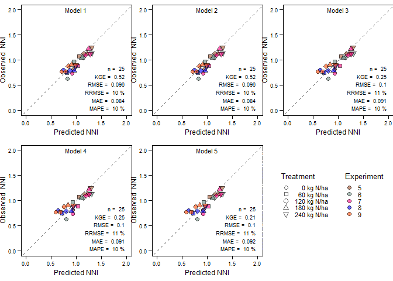

<!-- README.md is generated from README.Rmd. Please edit that file -->

# SPARK: Crop monitoring algorithm <a href="https://x.com/GRSueloCultivo" target="_blank">  </a>

<!-- badges: start -->

[](https://github.com/adrianlapaz3/SPARK/actions/workflows/R-CMD-check.yaml)
[](https://lifecycle.r-lib.org/articles/stages.html#experimental)
[](https://CRAN.R-project.org/package=SPARK)
[![CONICET](https://img.shields.io/badge/CONICET-blue?logo=data:image/svg+xml;base64,iVBORw0KGgoAAAANSUhEUgAABJ0AAAGaCAMAAACSU8JqAAAAAXNSR0IB2cksfwAAAjpQTFRFAAAAAAAA////////qqqqgICAv7+/////////zMzM////////29vb39/f4+Pj5ubm////6Ojo6+vr7e3t////7u7u7+/v8fHx8vLy////8/Pz8/Pz9PT09fX1////9fX19vb29vb2////9/f39/f3////////+Pj4////+fn5+fn5+fn5+vr6////+vr6+vr6+/v7+/v7////+/v7+/v7+/v7+/v7////+/v7+/v7+/v7////////+/v7+/v7////+vr6+vr6+vr6////+Pj4+Pj4+Pj4////9/f39/f3+Pj4+Pj4+fn5////+fn5////+vr6////+/v7////////+/v7////+/v7////+/v7////+fn59vb2////////1dXV////////////////////////////////////+vr6////+fn59PT08PDw////////8vLy////////////+vr6////////////6urq////////////////////////1uTyuNDprsrlpMTihrDZ4ev1zN7vXZXMcaLSkLbcmr3fe6nWwtfsZ5zPudHo2NjY1f//yr2HwbqO679T8M9++/Pf9+e+9d+p78tz7MNe9uOz89eU+u/U+evJ7sdp9Nuf8dOJ39//29v/AAD/gP//v7//7/f36PD3////8/n5////5O/0////9fX67PH2////8fH47e3t7u7u7Ozs8PDw7+/v8PDw5+fn3d3d29vb6enp1dXV37+/xMTrxsbGJsMgCwAAAL50Uk5TAAEBAgMCBAQFBQYHBwgJCgsLDQ4PDxASExUVFhcZGhocHR8fICIjJicpKy4wMTQ2OTo9P0BCQ0VFRkdHQz49OTc1My0nJCIeHiEjJSgoLTAyNjs8QEFERD48LiobFwMGCAkKDA0OExQvLzIsGBEQERQhJCoxMysgDB0WEhkbHP//////////////////Cw0G/////////////////////wgHAQIEHyEYLCYvKTM3JSUdHhshICIVDw4XDAgNCWnGK78AAEZMSURBVHic7Z17jB3Xfd/POTN37t1dKkWbpHbQNA9HTmwkaNoAgREgKWD/k4cjiiK53OVDdC3ZtR07DpI4fiSW70q5a8tZAwmoJfWgHrFEirtLiqQkuwFSNI37R4O2SYv+YSCOJcV5NA5iu0gtcve+ZqYz9zmPc2bOOXNm5szc30c2RS13773cnfud3+/7exyMagh2sYeLiP8v5P3j/8/7wOi/g6DoBwJ/4CAXmT13afTf//CGr7v/Av/VD7yG0A/hr/zIV/xH++FX78SvvBm/iu581fvn299602v/9B/fhL/hfdkb8Ncw+oG/RqMX4b+c8S+u+30YOX95J/5z5zvfiP/0Td+J/9AZ9I9ftsv+fgGAluCyX0D+YOIi4+Rl0/bEiawifPXETefY9WM30T34RYTvxi/5H8c/8uqbMX71ztcQ/hn8dfTtt/zdt78DvRGjL739r51X3vQXd373l+6+aTsIncA7rmM4ZG0Hn9zBaP3gC94Xu/itXzHu+rKJXn3nVzD6J2/8gztfwT/+vzH6ua+++X9+x2s/+2ff/K5v/uyfoZ945VUXvenVd/6f//fVO39szx2sXnrPBXs4dJ2yv0EAoCcLoE4BCEKu6Zy+7KkRdtevEEIQPkau46N42d27G+//sff9OH0VHbtq/KDxir36gnviMsL2WYy+vXPkKnLQ0auIHL3qIPPYVT8gW91bvYGOIXwDHb152tl7z609gt6Bvv/z5Ozn/91//8oPv+0Scd03/+v/Zbxy9Mb34x998e4vv3rn2wY7zr1PIXf1yt0v2Efdy6BNAMBisdQpiidOBDmnd7zfGAY+hvF14yTCOxjfhZfQ7n3faCK8j19w7/GyvD1n6H2W9xvX/545I6HzfnEN99Rlk5zw1Oo48oKo6+Sop1bEvecGQSfdO55E6+jQU+jw0sGL+H70jebu+vP3XHfco+7VY7vu0E8egfrT9v6PR+80THu/ueOrwL9PPVjci6oCi61OM4jvVZ3exYjg1fE15PoadHX1qotstHbZl5HUKMd7EO/zzuwi/9tKHMPXL+9RVq96D7k3+k67J666zuA0QuA11ZzOwBqOriND+EvxEDV6vmSBVIE6BRnpi5fcXUaegqDL/ocypl5+uEUge1sUOgOMW/3mUNXjmT2ru8A6BeoEANlpW8NW38wvUbe9u5zT+GRuj68noE4AkIU2JjhHWQqDh67rLE4kBeoEAHJ0mvtkqV/GM9uNnukuQCAF6gQAwrTxElZmLsliW92ax1GgTgAgQqd50CpdmOZYB475W2W/iLwAdQIAXtqkpFQuDdtd6tUw0wN1AgAeNm2dQiYKNYyiQJ0AIA3tlWkGxl23Pl4UqBMAJNEmSxVRphm2a9QjiAJ1AgAmGy1TS58pHbO79Btlv4bMgDoBAJW20aj4kDYmpNoKtXjq1Gb9QX3SdSAzW45R0aApAh5UOMuruzq1xxsHiPdbvnEDs4f8EXG0fAst3FgTMGajVa+5bbNrV/PWW0t16gwO7fuCJL69Iop1gFx3gYfEF5CN5aqZ4FyQrlm9m22t1KltDb1AKbsm0fB3WZh9UKl6U1NpGoPJsGJJXj3UqY0xUbdUJxG70Vu+BSJVR2otTRNId6PslyBAxdWpg4fNQT7BUiLWgevUqOsNQFt2vbwmNnhAqpLjVVed2qRJSr7XYdyr2+zAYrJpLtYmZcuuRo5XRXXqNA+wPsOYNRxvWjAeqnpfkxTE0L8XqmrqtHWAS0jkUvGiqJqv2qkrW279zSYW2gtUhdRJ2/UVU2zHqEpCD4zoNGrScymN3gJVEXXa0mrjF5vqFW0XmK3hImZ0MTQWqAqo05bjVOoq0vinDcyAsCmArpes5upUNWWaYO5vlP0SgCS2ujq6l2VCbA2Dfo3VqTorv2iY3cp0lSwcD65A2BTHsvd1K+xoqk6doVH9m1uF2t4WiE5jsXqbRMCDT5X9EkLoqE6bZiXTORogUJqx6VT/rpcrJtbIgtJOnWo3UQACpQ9QpePB0KburJc61XQOEwRKC8Bu4gX3mTsaC0UjdaqpNI3R5ee9uDy0DNokgN3SIMPTRZ1qLU1joM2gRD4LVrgo1n7pFrkW6rQA0jRG1663moAbjPAItEmOsgOo8tWpdjZ4IlXZXVFFTGLZB5SPgzbJY90u05EoWZ3ay4s3T6BbU0ltONRA9nA/+lHQpoyQg9KaNEtVpwetBS3watVUUhes5fdfRMNeN/RB0CYF4N5GSU9cztN6bBqLlNFF0XBsoOosWSa5+7u+/lzgsgJtUoRlf6yMpy1LnRY2bJpT2h2ppiy1ji8dXL17rk6gTSqxh8XfTktRp/bSIodNAbQcDK8q1q89s7Z/bXAwubYeMst9OfUDm0X7ESWo00Zz4cOmOdClqQzr7NKufWRnrE7QF54HRVfwClenzy5ekS6FEmsitWLpV55e37lv+5b3241DcJHlhFGkAVWsOkFKRwUcKBW0lsnJncN7r6NNAsF5jhRoQBWpTrCQkI0xgDnhjFiH8Knd/uAjJlxlOVNYC3lx6gTbK5Ipe2qg8ph3mMT5+BAKdQVQkEFelDpBB0E64JBnwjx785OvN8p+FYtCIRdrMeoEFRROIMGTp7H0AIbLrDgKKOAVoU6gTQLYBFqg5GiD4VQwuetT/uoE2iRI8U1vtQA6w0sgZ33KW51AmyQod21FJYEOp7LIswEqX3WCOp0shTa9VZ72yoKsL9SS/K7VPNUJuuKyAC3k3EBSVy65xfr5qROYlFkpYyq8gkBSVz456VNu6gT3MwWAQZ5Kx4KkTgdy0aec1AnMcEWAPiUDe1K0IQd9ykWdwHBSCOgTm3YLLjSNsFzFl2oe6vTbYDgpBRoMGDwMGy80Q/GtVL06PQijTsoBfaKwBXMrGmLeVljKUa1OkNTlA+hTFIjQNcXGymZFFasTxNq5AfoUBNoINEZZe6ZSdYJLJldAn2ZA4KQ3AzVXqkp1gksmb6B+NwLugtpj3dpQ8Cjq1AkumSIAfYK7YDXATvZVQMrUCS6Zglh0fYK7YFXIbo8rUie4ZApkoefv4C5YIYyPIZKlTqZGnaBUVywLq0+bTbgLVgnr1mvoWfkvV6FO7Tvgkimaxdz/BHfByoG7n1m/7Er+3BSoEwxilsLi6RPcBSsJ6QxdyXO8sqvT78AGi3JYtPYnuAtWlcF3fGIgJU9Z1QmMgBJZpPId7HGqMNh5SCp6yqhOcD8rF6UzlzqzYZX9CoAs2F+9JOE9ZVMnyOpKx36g7FdQBNBHUHkGD4rLUxZ16rQgq9OA4afKfgV5A3Z4HcBd4Tg/gzptDeS/FlCImpkmfQH7oCaQjwt+gbw6wbEG+iBxW6oOYB/UBtH7qLQ6wTWjFcK3paoAReFaITZ7J6lOHQNWYGqGopU6mgFZXd0QuU7l1AlsSg1RsbJCNyBCrx8CNoSUOoEfrid16y6ArK6ecFeZZdQJTl3Rllp1F0BWV1esHl+YL6FOUKzTmBqld5DV1Ri+Ko64OoE46U1N0jvI6uoNV/gkrE5wR9OeOlTvwD2oPRzhk6g6gThVgOo3Z8Jc3QKQHj4JqhOIUzWodnMmdNMtCGmXqZg6gThVhSrP3m1hsJwWhJTwSUidQJwqhMLj7IsFyi6LRGL4JKJOIE7VopruOFxli0VS+CSgTnDZVI0KuuOwM2zxYLcQ86sTiFMFqdrBLTAjtYhgm2FCcKsTiFMl4Z0Z0AOYXVlQGCYErzqBOFWVCjUX6NDlhL0L3V+AvXxr9J+R1Lgzju0O7Xu/NL3fa/CC64H5UdpHOdUJ6ijVpSrNBSV2OVkHniJ5eiRj03mChTEiaAkMsyxYLuX0Mz51AnGqNJUYvStlsM5u9JZvKSsdtK2hJ1MQT8lBCfK51AmGnipOBcKngg+sw0NHoSxF+D38j60+xFKixEvMPOoEhZTqo3v4VFx0bh3kqEtjzuFf9v/VPrRPTJjJESBqjnOoU4fk81KAItE7fCqm6GINe04BHWDbzlidxrQPHWCIoziJ3ETT1Qn642qCvuFTEX647RpF9Vact4PqNKZNmi6EUemEO2DS1Ql6CeqCruFT3n64Ney6RTbNXxjG1WkESBQHwc7xVHWS7UExew4yI1fdKEXE/lNCqFsKWoZPudqanjKZRU9DP+I2PsD+0zYhcPUnEWh9SlMnie5d0+HL7tu+XHlaBcZhcWgYPuXoh9t24crk81gffTj5MzpNB0NKwmKe3aWok+B9TdZ2bHsq1RzALaUAdGsdf9jJ53HxQNZnevx9GZ/6HEpTpxGbQwKtUXSm2V2yOok44ipi6M4AY9KEu0qe6DV5l4+radsb8l/8xL/P9uQXD/jUycdL80ChKEyyu2R14r528MBW6Dt2BqTVh59aXugTPuVRD7aGBmUmQoAL1nuyff2QX518QKEojO+hierEaQmY+xsKXk+cNmlBdp4H1ut67H1Sf+C9ZQ8zR4bnG9mCpye6Yurks2m34EoP43dmJqkTl+mE+/luYOw0DzDcWlSjxZnBqot1KqTJ46L9/kxf/+hAXJ18thwDjNcA9gNJ6sQRdlv2fiF3YZAo1TAXfhWH4ulNYqvy084tZ0rtziE5dfLoDA24zGdY3QR1SjWdcG9D5YtJo42XHGg+UEbZW8eVdhKYOJvXFOJcK0tqt+0XIaXUaftD/q8QQs1hq1Nap5M9LMG8IL8NCboq6Au/ikLhpjnV5sJTgyyp3XlfdZfeK/GVT983+U3HgYvchzDVqd1M/EJjUFpmAAqliDJbM9V1EhhKzKYgj7hZUju/ZCenTs+8O/AfG62cGsGqg/URpjp9JimJKnuZPsEPgUIpoKzeAmVjv7nUZJ7oHrov/bNYPOL/1WTU6YIRaQNd9BzP/S2WOiW5AmVr0wiCzY4DPlRGyuktUNXmZLcUuk1zLgxX7pf/6sf8v5uMOj1mxL9o01xcgfJunQx1SsjrNDpj1jAfgCJHRkroLVC0kyA3c+HJfUQ+JP3VfslORp3O23QrfVEFyvoI0xVn5nW6HeBonN57wIQQKgNmv+C7jZI2pzzb7C4eIPnUzp9jkVKnR4f0tSvId8kbi3eF9zdY6sSq12k44u5FgGeu/aa9BC6ULAX/UFWIU04p3ZRzSD61e7zn/yquThcPzF9K+OOFi6BGy36o6sTK6/QZ0IpAzuyZbXvhixyyFPlzVdDmlHu92EvOpFM7f47FC0iTlIbxdWmKtlAC5ed1DHWil3uxo9NwexSCG41PgUDJUZw5nlmc8p6c8nl0IJ/ajUp2Eup0jqeDc9NYlAvcz+vo6kQ/vEeL0axESMO48A0QKCkK+ulmFaecU7oJnsIkbbdMZGSKi6vT07cY236jbHUXoQw0WeJKU6fPUQJIvbYCsSDYNM1PgkBJUEjneMYezKJagJ++JT0ptz2+9oTV6bE+f7S20ay9R+6Mf9AUdaLd37R1nOIYDcN4AARKGOpR0WrJJE7W7cIGA/1276bchswn90f/ElWn8zYS6U/vOMu1tqCmM6BxdaJZ4uMssDJ4KZ75a8tQxRMk71tQFnHCZrp2Xux/UP4JgvgSI5naXRj/HUXV6anbosFanS2oWRwfV6f4eKYG2zZEIfj03uNfs2ofAasl1x90lgZxm3D5Co+0ZMbb4ox6luRSu7EpLqpO3hNKqOFGXW/AzvQyjKnTZuwjWh4zxINhfnx5gYqwKsgvSM4gTgbvErGse+Nm+Na2XGrnBUE+gjtYnnldrkjYadTx+p7v9olpUaxLXIupOlkIfnghahzKyOtWJC9OItffE7ZsqS2Mr05yqd24ZIc4C3CBr5Jdi1C/Gh7+xPy3kT+KdfI2iijh5gn5/a/V20JUSz6tT7KjdaJW+Lk73p3+Sen4y3elUrvxHIuoOmWoEfo8VK/ruze/AKPqFAmddNmPn5E6W4jKyaH1SXJ6RbxMl235yYyRe2RIeOzjORZRdXqsn2F0xqdOAVTCSeWRXc9Wt3J+OIsHwSLnRXnrk5w4SbUQnJMSlSh+MINkwrDxHIugOvmSlmlZsE9dAqhAXhdTp3AjZuHj67lSpxtMvihuvZUSJ8n2Jk8eMmw/mTLuC5BItiYlOzF18p10BZq65dahhNcLJmthdQqHTuUuns6Dz9axxJEHKrM7GXGSb708h6zshbtxT6WEYkxMcSF1Gj1ZBttpTg1KeOELL6xOodCpfuLksTWEBI8HdWGzzMFQGc6L8YIn6Rm5GWNzWzy1257amyLq5Mdb2WynABWfchmvJpgRUqfQXa6W4uTRNiHB40DVYIvE3G+2HpZzCkycSQwkHNBM5liQUPzmP1f2Vzyj0hUgN2wphNQpWLCrqzj5QILHg5JGN3FxyroZ2jemxReYRBirk3Bqd2Hm/PAL28hIV2Hlz6msQx6dpQqqUzB0qrM4IajgcaEguxMWJwVLxPxjB7K+28futnBE88jsquJXp9EpCZmd/KfDjRTVNDAieV1YnQJTmrHPqx3V/PkVS+advqLipGQPgR/AWMNsb/exzAj765M5FiSgTqMOqcxG/uN2NFrcdKpnYLjRO1NAnQLLCWrU58QGDKh0sq0tEBUnRUNTfjSS0WaepGii4yXnZr/jVqeRoGXtcD9v0ORN6VnwBRC/2ALqFPjLOAsgTsivwFbs51c8WdYWCL47lB33M5KWbIW7iToJpnbTORbEr06jc81ll0nNH4RhtD24UiEDipKvBdTp07PfVX62jp+q3V+KR3ptgdi3VuVyuZGVk6kMNtEZwYxrOseC+NVpnEJms52e3GdHihUyMCgX2lyd5n0p+m8QV0ml7i9lIJndiYmT0t0I48gnS0AyjYLEUrvpHAviVqdxg1Q222nb7CcVAapiYNCugLk6zToxK7SlVw2gT8lIZXdC4qR6a/AoeJJeSuIzcZDEArB5yY73QLuxnmWynTxxSjHZKmFgUOtwM3WabZ3j6CXYur2h5iXpAuhTMuLZndCWXuX3w3HwlKVwN1EnMXN9borzqpPkCS4BPHHi6J/Qv8OPeonN1OnhSYdpernuQcuoXzMU6FMiovohIk55HPczDp4yOOPTMEjIERJWp4n5LnGu+YxHB3xjM5pf4PSYaKZOU088zRH3IvZ6NkNp/uMrGbHsTkSccjESJm97wRWVAabqJLIuajbHgngFZ9IflWEE2N+TxyluWo/g0bsEpuo0PWEzpeVk5Cb0arGRLg7oUxIC2Z2AOOV1TqLcfu8505kUkdTuQuCvzaUY43aCDBo6Eif+L9e3gMcY+56q02TELrT7KcbY6az0ovFkQJ8S4C6rCYhTbhWYyRtfeqRlpjQCqd0zr89/z6VOcge4RJ9RJC/UdMcZy+ueqFOHjP+dFBZN3rr1zOumgD6x4VzjzC9OeR4wPR0qkfR0Zo2VAqndfI6F72mn+1akbadRxU8wPNSywYDV/T1Rp4fM0b8S9upskklUmGH3TiUAfWLD87PnF6dcjyKbBk+ShbuZOgmkdgFTnKvZatoeJWs7jb9e+Kv10yfmZTVRp3Fil9BMMC3p1Tx0GgH940zSBYVfnHI+YHoayUgW7mZSw/3uD8yx8GVrcqdLzRgnnzLOmmb6xLaTxuo0SeyYed3GoVk8UWPXaQ7oE4u07C5+kjSD3HfWT4MnyV7HmTpxt5wH5li41GlqbUnaTuO/n2ybuU5XONtOGqvTOLFjTrA8HNi2txgDwh1Xq7uLTiRmd9wXfQHTUjMbSOoQqVnfN3fsNTrIZQqH5Dw2uePLtbRPxFfeUddGnxIuhbE6jRI7Vs7WviNgxCQX9WqEZtGvRiRkd7xXfCHHJM6CJ6nC3bwAJzbQOyFdNWYvT8p2mvRWZZrQ00OfkhRlrE6jVkxGH+bEMJ+wQBPC+naHlAxTW3gv94ImOec1NIkdAPPmJd7ULmiKc6jTo5NNtFK+mD+/wvc0ieigT0ltAiN1GrViMm6JESOhrp2YVAJ2GxCEnt1xXuuZN27yMg+eJEKMuYvEKx9i6iTTsjBjKk7Zj3IpXZ8SfeyROo0UiGoodYxI/PCbyl5WJZA57mgRoN3KOC/0Ao9wneda4gGK8Ca54BwLhzrNtq1I2E5TcVJxWMJzf1eqPiW3AIzUyU/sqBoWspx8cm1R0ZLSby56Em+k5PxGFWkNBBRGuPC+Pa8E8WnAhVArRWqbgHjHwpxpUqjkFDzy7N+WeMRUbJV4CF+dRstTaEFR/BTXBbKdpoA9TidyKfCJUyF2+JyAUS3s0MwTNb6WhOAcS7o6zbRMwnaailOmBVYBWh8r7RJPcSB9YfJ9b5qTQDlieoF2+s4Be5xKqHeX7zjyokPvYIOkaBb02Dxt4ApvgnMs6eo0e3TxbsqZOGWYHg5BGuZHytGntNZuX51+Z0j9NNoFt1Cm+ByYbqERzu42lnBam3jO3eEUAsGT6EhL4Eu5hC1kiqcpR4Zuh/l64CxroUIYp6+d/N4y9Ck5rxur06epoRP1brhgpvgcsJ9oxBL9NiIIY2TSgs0sx7vIEgyeBAt3gUyNJ7ULzbGkqtMs/hG2nebipCp08jGalvWBFZF9pipIDaXxyHaihE70UH1h1QnsJyrsAlwbHdrHuDm/4MsZgQq2SIpZPEGXm0NCQnMsadIxlzJRYztwsELm84ODGI1TBrmzWAsjfWQXj2ynuNlNF6eF6RSnsYUhvYuRel5BB9utofpzDXgJhTRCHk9QbjjSr9AcS5o6zeMyQdsp8KIynYgVh1jG2sqNXylSn9ITfTyynWIhEcPkXLyGghDhtnlgBE9M9CAp7cIJzZeIHCIV1DWO1O6R8Ns6OSaae1RittP5gL+QYd0vHaNhnSB/+O7CLFYOMcG+7RS7wKbL6CQesN5wj+AvEGX4SfyE/SCBGnyg4YnHsjoX+e8k8QjEWUIaExQnqdHmZAzTbLxr5fmC9IlnFRNG7Wa8TfxzjNe38Oo0X8IHzCm+FidAqA9JpHAX1Jt0VRNRp3mzgpBTL6iXEhjmyZvvsn/qb4soAdGPiMKhzlCMHmzENIe5QQzUCYZbaGh9QGtINwRc6EDDU7rJE55jQYnqFAiBRHZPzeZXfDKO/7IgZ66tvdR8z1v+Jnd9YhwRhQ07oE8YPexEWywfZna2gzr5QHoXo+AecCECZS4kUrgLOkmpocqF6A09QZ0CfZsCRlhInPIJnXyIZVi/9PSPvy3vEjV9T5yBT10KqdNnUKQQNz08igKo04jNJlTvomi8bj6cdHHXukIpYVpqF55jQUnqFHTCBLoCgqGckL0vytlra8bK9VOtVp4eBv1ywdYauhwI2zD6dKSdgOWI+4A6TYDqXQx9r41w8MRdJguFQ2ma9mi0yM1Wp4CQCYRAoSdQMv7LhOCWl97dv/Pe/NoLGCcYmA17PaRO7WakneAzCS9J3yuwaDpW0Y212pPn+U/ZiDjWnBMgwQpZqo5ETfEEdQp8Kr/tFFY/BZtTEiFnXjj5hh/75A/+TF7lO3pe1yDre7btzlM7vGGEFSdxZAPUaQ6spouh64kYkeCJs3AX7kVIzsEicywoQQKDbZvcCVq4myrf0GnE2b1TLxnLbz37V7nY44y8zsSN47snAsYTfmgp5Ilv4tgXBQB1CsKuHiwqBW6WEyIS2XA646GvSu4vOh97EzPVKegf8c7xRuRV2fhvAuTMNeuDz576CfwV9fY4a+TEMsyje6tBdfrtsOAk5XWJB94tIu1cjcNKomfrU+TdzTlAK9CKEJljQWwFCekYZy9m5OWrHP/12GZEhUbj1KFDxn/721Xl08GMTSeNhnH8mn382flH8GdD0Xia27u4U8B0oPkpip7hddQW4uq0Dm9sSkztHondpljqFHxQTpmJSp/S0GnbYvr9pHGKHLq29IPf/W/U2uOMFZa4uXbDsPuhzG4rmNi1mykPDOoUAdzxKGpany6qTV5i7Ug8vnJYchIF7bGYB8mQEOEDg+NZo9LQ6XEnKcs9e23d+ILV3MRfVmiPs/I6wzINbA/tQUCdQp+Qesw0qFMMcMejqFjvvO22lOpTTD44Oo3CCVViahcr2bHUKaR4XEFQzNJSOf77iJlswRmNk8bK//3eP/27h15RZo+zNliaLYO879HhcDh/ppA6pa9fXdDdmMlA73gEFeb4tklUrgiJBU8crUaRr0nQs3jJjqU8IRnj0ZnYiIzCzSnnDTetPkCsdfLS0T9oNsw1Rcdjswq75N7r5vuesIfHLjPUiTX8Oydt1eZiAr3jEVQcWbdtIkfhMFkseEov3EWiloTyf0z7WM3loXCMJ0ULza+MUBc6PfM6R/GSnLl2wli+3jiKX/1JFRPwzNUEhtU4cf3Ytf6xS/TMjsPi1XheoVSguSCCAnPce2OuOMrSu7iApLZCRiKihLdybI6F5SmFNJLDmo+Lk7LNKU8O+3ydFWd3TxIDv/33nea/fGN2+4kZ3zROmTcwGfaHDN8pPXTStt+udGCzSgQFneP+W1OdBRw3rlNN6YibxI5aYnMsjAcPr/flWDYVe9HKxn+9KI53IPrsrrF2wzzW+Gf/4734LzLaT+xtFkvrb3jq7heZ6sRTHdezXqwFMHoXIbs5PoocVO0KoWRfaYW7iDqxU7u4KU5/2eEehfQcLa56ir4bF8ltgW0NBJvGGnmJnHzbx/7tWzLZTwkr51pLGBN81+6A7opzhE5cC+0WFejNjJB9aeZInla6aqbK4sFT2khLWEzYb2eKKU6VkbDDna4OcXFSFDr5HVRCZ0CQM3vGKiLG8i5a/b4M3U8JvvVykxjIvf/vr1DVia+xEFoKEoDwKUJmm3Lsu2Cs4vgRSvCU8maP9liygp34HAtdnQQaqHwo+aKS8d9tYyB8BjHxhcKLoPALnsT8umwPckLq1bAs8+TeiUuHr1AzO57QCVoKkoHwKULm0aeJLazEC44HTynv0egADCu1i8+x0NUpnACm2U7RZ0eKxn9HKi3Xl0Dw6as2cQeOXBUoKfMylhpnd07sMGInvqOmoWiXAoRPYTL3FkzkycLZ963RQpzEd2k02mJV+eJzLFR1ishNiu1EESclodMoIsvSNGX4K06k7sNJQ5hma/0lcv/F4eGdPiV2Sh7/nb80KNolA+FThKw7x6dF9YaZubsg4iONSFpiwtumTQnKaEoW/rSUOIgmToLZGI3HXf9FqOjoFJ+RSCypnX2hdXrPde8736fETqkTdtPPX+TzNvmA8ClM1t6CkU3iI3JEABVa8JSUYMXcbkbsQinZUVohIqcFJysE9aVmH/8dR3mK2s0TV8HFSa6onb1hWEdedOwebZKF+5nAFk8FwqcIWcOnqT1sZW0epwVPSYW7qOzQ9ZFWsqOoU+TJE7M0qjhl7v16cjgKd5TNwrSFdqskm0JnyYsNgk5cvsuh9Ip/mvc5wBbnAMKnMLib7aqZVa9WXP7jMilQ3/QJKRbfPl5KMZAiJdGBuSTbifo6M4dOk452lUecC6R3KQUSc2ltufuSfT8ts0s4hyUC2OI8QPgUIWNr5ry4ni2AoAVPCXZOrKZPDXgocyyU1ylwlHl8fsUnY2J70R4/qEpxQgI3Yvoq8RnmvS+d3nPXlh+x46546uqUGdAtzgeET2Eyhk8BncjSLk0PSphv2FgxjqoQlL4kijpF4rAEraGLU8bx32nXg2JxQqjD1zyeFtWcvbH+InHcwzal34k7sQPjiRcInyJkC58CEmDZ8oV1avAk0MhEkwiaKR5TJ97eKaY4ZZIVf3Il+6Mw2MLp6V1q45t55qV7sXP5nitxV5w/sQPjiR9YXBAm29qnYBwj3zxOD55Ylk7cUaJU+KimeCxdjEoYe1sUNRTLFjrN/h55iBPiSRRS8jo/dvrg06fcK/f9vRPcKz76lT+xA+NJANj7FCHTtROKPqTfZvT3PqNwF1v9RntehuCF1SSqc+wZGoY4ZchnZy0ZeYlTevUuPW42zxgvk9XLR3bj+50EEjswnkSA8ClMpvApJE+yzeP0SIfhjMc/maIqtDkWFFWnaEbJtJ0Y4pRh/HcujLmJE0qp3nF0SRrLa0t768+5veNRdRJJ7MB4EgK2jkfIEj5FFn3LraajjZ0gVi0wbinFUzvGA4bUKRZfsWwnWou4j3zoNJe7PMUJJbZMcrhBDatF1nfvezyuTmJ3eNjeKwRsHQ+TJXyKvHelauyM4In+3o2rU/zTaHMsKKJOMQVj2E4scZIOncaTKyNyFqeEOhBPPQTfceKl914cHtmJqZNIYgejdqLAmXcRMoRPkRhEqnmcEetQe5l4NixRS3ZhddqO3f7pHjdLnKTHfwN/19zFyeNB6mZfruk3o9Uyjty0735+EPgR++rEO2Mn8mTAHDjzLkKG3qdoiiTRPM4KnmjxDEXJouU91sMF9SemOvQ8MjKJN0dyc8pkcmVEEeKE6GkYV5XfWF5b3nWGR65E1Un05p5aHQQiQGtmBPnep5iDI948zgqe+Bzv6Kop6hwLCqtTLLyi2kiM4h+SDZ2CPewFiRNtwT7flCVZOtUiV+5yrpyIdBSIOiPQUyAMtGZGkA+fggHBGNHVdMzgKV64o0hPNI5hZWMBdYo/Cq2/ii1OUptTQt+npD0xqoncijmXfRvNky+v7Q6OxNRJzHZSsPBwEYHeggjS9mW8l1q0eZwVPMVt9njDUywBZLQABAUo3qBOsZ3i3hTtobgJiaaShb/chGdbOItoRuvk0p476NsDN+SKd4jo00NPgQQ8/f4LhfTeJ8qoBxY615wZPMXCMNpnRj6HYYoHJCUeFFGyUcb8CuOz05hNrowIiBMp5CYZ6KPh3Z7jqdMbnjqxHFrc66uTWLeTT9IGToAJ9BZEkN37NG9+niNkrFC3CoyIRhkU7QmndsyQZ65O8VAtnosmiJNE6BS2y4qNnMZMUwXuQ5zMpbU3POX0hnbEFRdccYcgtZMFegsiSG8dp6RTQt0FrIAnNtJC+8RQasd0i2aaQtGveEsnfTp5hHBX1/ZS6MHKEKeZ09r4Dc7Pb7bMY02ytD0MLFDx1Unilg6pnRwdA8zxMDaWKwDT3B6B5nFmY1G0cEd7nlDBjVWym6sT5blithPLvKJ+cgqRVxQVJ+JiVEh657vj/GNv1sq9dzy1eqkfjZ1ETXEEVTt5xAPVuiN5LVH1hT/MYAZPkQIZzUAPfQbTYZ+pU/ypYjW4JHES7AWIZr2UyKnBd/xSZjoW4T+ct7X+B3e/tLpyzsmuTtCQKQ3sLYgi2VxAD39459HYwVNYDqihUTCaYcyxzNWJ8ghR24ltgyHR0Cn6bBRxwt57vqACcoc/MF4++dLRF73YKbiiwFMnwU7xMdCQKQ+Y41Hk3HH6bgDe5nF28BRSOKo6BbuHmI8zfRSKoxSRjASlFB3/jQZh5XhOEuCVpnkS2c8O7HDNTsqqhVm7DIA5HkXOHWcY0nyr6ZIkIWBaU5sPApkZuzlhIiu0FxkOhxLFSWj8NzDyO6Yy4oSMd32BrKMr/UHEFZeasuAuFAIUwByPIeWOs+plXM3jCcFToHBHV5+5vDBN8ak6UXypcEsCc7gu+ChcxJ6qOuKEWqfuwFdXr7z7kWE4dpJLNLgrhQANMMdjyIzesbqEeJrHk0KWgH5QRWye2rEfZawrtHaokLHFnl/xEQidYoFTlcQJN1tWAx+/8u6v76hQJ9iQmQ0wx2NgR7x3nNnEyHGueULwFMjdUo40YFfbxupEU6+gaiSLk8B8XNxZr5A4IdI69XLDuMdd2j4aGLPz1EmiZOcDLU8ZEdnlviDI3PKY8pBaiWds3I18Nb1jYJbasSVurE60Pw/YTgnDdT7cm1Pio9GVEid/Q8HKNXMw7PfsQch3klQn8MWzAuZ4HInmJ6Y8pTaPM5sBfKZRC12dpm/9BHUZqRPNlgpka0nzK8GnSYPSklApcUJnyResd6A/Hrz7nBp1Al88M7BWJY5Eese2flKax9mOts+kcEf/pGnbZ0JiNoq+aAMq85bRNHHiDJ0ogVPFxAm1Wu+61nDte57vDkPqJNXu5AO+eHZgrUoc8fQuIUVLHu9PDJ4mhTuGhE2yswSB85+aKl5zLylhuG4E3/hvmrWVAYKdQsZe8NLJNz5r/N6HBr2+rUadoF9cAXBkCwXh9C7JWk4qyScHT2NnnNHQNHn7M+dYxupE/ePZEHHS/Mr0EVIJ70oZYxlSp9VQMPCpy8jOfe2K2Vo/dOOtXxkeeXZ4LOSKS6sTnM2iAtg5TsFyBeNyWm4zZaXLjiMSg6exOjDUaZKeJTyA99VUV2pmO6WJE1foRIsbGUeHykAM4iK8dilneTKWrVbDcJzDt/bC6iTvzUJTgRJg5zgFeyg2e5fo4LCbx5ODp7F1lHjkSkJXgqdOVEdsGhEltogHPzEBWuCkUpwQMYnpouOhJqQcaLaaJ754Yte559necUXqVJVhu2LWAcoDrU80RGvCiZEIs3k8OXga5W8MARqZ5uw5lpG4UL90kmqmihPH+C/VcFMpTv6677XryEH9oZvjuwg3llqtc7/u/vzefeeUqVNFmgowwprrE7Q+UbBui9lPiYP+rHPNU4InP7liWEujuCrpy/Ev0/90nK+li1NqvxZtQ6hqcSJn8A1sIPuo417OL3wizV/pfvNPsPvz5Nt7x0M7CrJ03VSiI5Ng4pCCNtrIAq1PNAS7C5Lf8Izm8ZTgyXo/S51G9lHSU+JfppfkRiFRSov47PMSoGufWnHyci7rgxeR4d7/2CBU6lcLWbasJ371937153Z/ca8b/M5kUqdKBE8EmwitobyNvWy074DsjoLYbHDKW566mi55Btcv3LHiIz+1SyjZee8O6ssZuUkc4pQSOtEDJ+XihM5eNxpkbWd95fF+N7fgyWxZZ99B8PbZP3kKqVOnSgRP2CRobQ+5KOU6LBnY+kRF6AaYVLpDjObxtJ6jO/qM68aXj6RRPYSp0uVbYBzilDL+y5BM5eKEzl6zLHwS7Qzfc6E7zOsGby5Zz/UvfM3uHxy4PXXqVIXgibgWIideQLYnTzrHT+JH4ywEQvZTZN9/DMpqulSlYO259fQjZUqOihdypbWI+yRuTmEETjmIk5/aWY11tHfsYPeeZ9M/Ww6zddXtX/jLH/ryfhep6ijwqULwhBrYIMRBeEjsnCujmYCtT3SwKdD9JN7hmBY8MVl+D+0szjQ+zCVOiaETKxvNQ5yQsfShZwzs2od3WEFkdszWNfz+7e1/dbm77wQP28yqTlUInrzwqbF+1UDO6guOa+fn7WUHBlvomLf5u59Si2HRqIQjzaJz6L60ih+Fxgd4xCkxdGKZXbmIE2qYlmXcvbRysd9NLTPK4mV2S40jf/4XvZ8b7gzUZXYVCZ687zEyDILx0RecQe6NrxmAwRYGAvZ4ms8dW00nGzyt3J9oitM5dF9qizhKHP+NL5mbkI84eald40O3997z5OG9g9yuTXOpdel33/pl/OUzjxy7rFKdqhE8eZiePB2/io6jqzqndzDYwoL/QkvxxlG0eVw6eCIpLheNpsPT3MIe4mUKYl7ihHDL/OC3biL7yDA336mx1Gy8a/fumz/9xe5xpeqEelLH/ZSA0Vy9Sjx1cnddjeUJdvoy4R4OTvPGUaReLxs8tSRSHYsnAGGGTszAKT9x8u7rDdPY++tfH+bYUbDcaL7jv65aT/d/Idz0iTdxtkeuzrSdYbomIggNHayz+bSFIbujw1++S0+5gs3j0sFTXrBCJ/ZfK0dx8kKbbcd98+Wd3Gwn1GieXPnmnyD7Z194pxvyXTLsKJhQmeDJ+y64Fjl2Fbuug3TWJxhsYcFdvksfFAmuppMu2+VD7KjgMezAKVdxOr/8eutDBnZXc0vskGl9uHvjLfgnL971/DHF6lSlPU/kzB52nZO7yLHznGrMCqwtYMKrTzzx0Kx5PGmYtwTom1MS4sH8xMmTJoRb7224LrHze8M0Tn3PMy2y/jf/6Rd2D0I/t+zqhPobWR+hQAjGBl7bc9aexxrP3sHaAjac7QVcXUXT5nGJ4lt+UDenJFn9jFgrM740Ja7HUgVe+vAz772Ezjzd7fbC6iS7V3xOxTaMYwOd2lm/jE5r3FkA2V0SnMufuEr34+ZxrYInWuiUtIAhH3EaSVP6yRFKIPd+zzPm2/+LO7jruX7oTalAnaTOSSwR4hDHwAi7tk53zCiQ3SXAp08c5tM0UtEoeKKETok9EnmI01iaOLa4qMGwrHddu++S/fPX9geR2Okz2X8wFWnJDECI97fW2XqC7C4ZLn3iK8b5c7kaBU/xzSmJm6vUi9OTjjO+8tg7RRVDzFbj3hvIPnb70omQ9y57FnCI6nQVhNB9aSasLUiCfDz9czg6n9C4eVyb4CkWriQ3l6oWp5k00Samc8Py1Okadt65143GTiqGu6p6AILm+gRL6RLhaR/nUx3cQroET9HQKTFwUixOc2liLhPNB7NlHf8P6O3/sduN+k4q3gIVM8YrAyylS4ZDnxLPI5/TsvUo4UZCp5SpHJXiFJCmhEXs+dBoffD29Xf80dGV3x1E1EnJXqGKGePVAbK7ZNL1KX3sTiMim1OSAyeF4hSSJr6D9FRinjZfPvJF9/jnu8NIZpe94cmnIuezVA/I7lIw9tP8cZ7WAk0IbU5J01VV4hSWJtYG9jwxzty0Tu+duHT4clSdFLQUeJgfVfEoQJx2SxfDVldS63dcrQU6EAqdUgInReIUkabYfplCIE3L8pKE4eHL4fU3qtRJ/HhpgBdYSpdGmj6dN6qR3QVCp9SEVIU4RaUpZWNwbuBWY611de3KL0a2tGBV1gYY4/kBK8dTSdEn1iZuvQhsTkkLnBSI07YVlSb6sTUFQMzmB28TZ6d/K9yhhpVtFKpo01MlgJXj6Zg4cT64CtndbHNKupOfVZwo0uSP+2Z7UGmIl9odb+0d3ourk6o7c6WmgasGZHfpJO8v0D+7m4VOqYFTRnHaXnbjXapFjPsyMU/fNE7v3O18PqZOaop2Xm7XhbpdfkB2xwHuJ7mfutfuJqETRwtEFnGiSlNB475MGqZlEnzYtmO+kyJbHOp2+QLZHQ+J+zM5OzNLYhI6cXS3y4sTXZoKG/dlQprrb7h49IW7KeqkbFsH1O1yBVaOc5HQoKl1Z+Zoc0rCAswZsuK0vdynP3hh475MfFv8mzec4e2wgeGrk7qrHnoycwVWjvNBDpgFPG2mfWOMGrR5Xp5cnPOkYzAmoosc92VhmOvkRXRPZDXmSJ22lOXjVdriW0XgQClO2AW81OPuysILnXgCJylxivc1zSjZcJpinr6BP/APO724OnWIsifhWWsBZACyO05wb4P+B5q2PnmhE1dcJy5OCdJU+Lgvk8ap6wQdo6kT+py6hKEhcOY9IAFkd7xY+4zRdC3N8SWHJ3ASFqdEaSp+3JcJtiyC3d6JuCuuspkG2gpCYKTc54Dsjh+GAXWR6HVElEcDcUV0YuKULE3BM7NKBzes1RfcYS/uiivtpYG2giA4DxMWVo7zY2Pq3VLL8CkdEXFKkaZyxn2ZGEaDYPv4cxR1Umg8iRx4vxB40ZNyiYKV4wLQr0etewtY8ItTmjSVNe7LBBsNA7lul6JOKk4+mAMTLRFyCKDgQCl+GA2a6eMiusErTunSVNq4L5uGeeL6sSsDmjqprQRV6OzyygLZnQDYoe29r1r4xCdO55d7qX+t8sZ92RDz5NXVHao6bWKVTwTLVAoAVo6LQF+wUoW9BTN4xGl6Dl0ipY77MsENsoYuR1KCiSypGrUbA854EcDKcRGo9pOGxTsW6eLEJU26dF/GwBY5sRvNSCfqpHhBBzjjRQArx4WgToFWpXiXJk580lT+uC+bhtvAx8PtTlN1UjfMMgbmgYsAsjshqPa4pq3jEZJF5XGH8+9Q/rgvG0+d3EHE/54aTmpTO+gZLwhYSicEdT8d13RbuSSJE7c0aTHuywY3iLNOj53Ul6hhXUEhwFI6MajlO92bC5jitE0wd+Snq+E0pXHyeYTorrjy1A5GWgoCltIJQivf6e2OM8SJtUmOji7jvkyI4Z66ElGhWSuB6tQOtqkUBawtEISmTxeItukdVZwuGiLSpNG4L5sGOnmZ4Tvl4GBAX0FBwNoCUWiLfnRtfmq+L/YhjmbwEDqN+7Lx1OlSRIRm6qQ8tQN5KgxYWyAMpeflYlfHHNmItk6KSpNm475s8L3POyx1UrnkaQrsoisKGGwRhqJP51va2U8RceJtawqg2bgvG+Kaw8j9Ya5OedgX0JVZFLC2QBzK1amb/RQSp8f74sGdfuO+bDB2meqkdI3KFJCnwoDBFnF016e5OIn0DszRcdyXDcaImdnls5UD5KkwYLBFAsr1qY89PhUnwQLdFD3HfdlgHK3MBdQpB18cgTwVCLQ+yaCvPo3FSdgFn6B792UcEk3sguqUhy+OQJ6KBAZbZNBUn3xxknDBJ+g77sskvoQ/qE45FX5AnooDWp+koFyiTzPOzS0Mw21wT9DF0HncV4DQ2jnl/eJjQJ4KBHb6SmEMYoNX5frjK0i+u0HvcV8BQuqUV2IAbZnKeMi0EXJdh70cGVqf5KDMt2jY/8RB9QwnJiF1ajdzehaQJzW0W7PMHBPCWFIDW58koejTRVcDA0oM7cd9BQgvFM+tZwbkSQXRngGzS6iLIMAcl8TEccW/0KxSAFWFcV9+wuqk9vSDILBQJTPUaTo8oAnUxiEIn+Sg7ac771SlU6Ma4778RORI6cF2Iawe7dQegBvmnjnc24h9DOaCpaHu931CrueoWKoy7stPRJ3y6cgcA8t8s5CYdBM7Jv1gjktj7X8q/sHHTd0TvMqM+/ITTeXyC56gsyADqUO+8QAKzPEMUBoM0JMHOid4VRr35SaqTnkGT8h+IMcHrzM8Nnf8jg/meAZsQnEitE3wqjXuy03MBs8zeELYBm9cnEAfQTLR4BTM8SzQD3DRMcGr2rgvNzF1yq3naYTlgvkkioiDFMlIwBzPBNUg1y7Bq1H3ZZR4C0HOe4KGFMcRYCO6eCASP8FalWzQDCi9ErwKjvtyE1enfIMnaMwUQ0JdfjP0X9xpIUDHbumc4NVk3JcBpf0ybzMVOp+4kcjM4t9dMMczgvuUBE+LFs3ajPsyoDWH57SqYA5kd3xIBE60nnzYOZ4ZWoK3bZU8g1djw2kCTZ3y9yrMPtTuUpHJyRhpM+wczww1wSt1Bq9O474MqIN1+SzJDNHfyP0pKo5MszfT02OOwQDcUCt4pSV49Rr3ZUBVp1xbMidAZ2YiUtlYQjM+9BaogBzE92qVkuAVPO570fu/YyNjWHBfFX0pQRGZgHVrI/8nqSpSP4AB5d4+B3oLVEAbuS48wct93PeiXwpAaLR8bxobYsMpvDxIV6dczraLAeETAzkhSZuyht4CNRj78QCq0ARP+bjvdnMUGiGzh9AyTWix0ShlUoax0KmYGy01k194NonMlc6zQAv2FqiBFkAVluApGPedhEbIP/079VprNJ3S2hZY6+ZyHbebY95mL8heTDquVFbN1+MKewtUQQugimjRlBn3TQ2NmJSpTD4sdcq7Y3wGrFUJ8Vlb6svIxzk/EVozVUELoJ40ZI+f44Nv3Nf3sP26ln8pNaRvRyv2oPTZYuaq3sKyAHDH5zy4IncxJfvhIaA1Ux2UpX95noPH6L70Q6M+HodGpppquw7K5MNeJF5Qbue/hi6kdz6yC08EFz9A+KQOaz++1j0vh3w67qsmNGJiNfvvU/6gkrDVqbDcDkH1zmdrKHlRCy/NggODVWLub8Q+lkcA5b9TFYVGTDxlGug0VZxwCEuhFZ5Ft5+ktUlK2WGyRSmUDE+LIWExsKWVMvkkHRFVXG7nI+Cd1A55bZKcqIatmWqhZXhVOgivrIamFJLUqZiezBkL2/2UQZvkt9FA+KQYSg3vSacKJwk3mraOyuSTeLxm0cMPC6lPGbQp064HCJ+UQzlKWPMMr+yGphSSD/8t/Aa7cPok20MwIqNZB+GTeogREyht9mhGWLGJzsrkk3I0eQG7VKIskD/eacj1Xk7IfHwphE95EPfIt5ddzQRKl4amFFLUqci2ghm0PRU1ZKubKXZRcvoWhE95YNnDqEBddLU5KcFq7ldBmXxS1KmkvRuUBL5uPGhlMyS4Z1eSgfApHygC9aRTvkDp1tCUQpo6ldVZXG8DatPI+l1Vt1sUwqecoEVQRpkpnoYNTSmkqlPBXU8BaFNMteChRtZvqdK97DB5lxvWMGaSbxNcwObZGJo2NKWQrk6dVmkXL/Wonoqz5WZfoau6cACTdzlCqeKdX853lUGEhltFZfJJVye0yfE5uUE9CqOyZM/oUC7nAUL4lCuUUbyLRq+QEErzhqYUeJSn5I3UdcnwNk1DhQbkMzENazPzBQ/sWCH6fMPI1YVawVVWJh+uuEhyJZoyKP5i1VAkTfmNI8LW8byxbBLPA/JSqIo0NKXAl7X9TunHDVVaoLZsVcZOnseUwqEt+WPum/Ef4PkltVmeReqgTD6cnlL58oSo/qL+dOwldd+7fI94hzPvigATSgiFLg6WHBVBVMUamlLgVKcSC3chzG48fdeYLUdRPjci/x2i0JtZDOaBQ/tRZpWoO+qkTD689Thd5MnvIelSomP92LQztzWFUdQdngz0ZhYE8zK+2Me22MkpI6rZ0JQCd7dAKRN3LCyb9HRWqE27pTpJyqGPgAo0FxQHPckbcRH3zR7v1vDqNjSlwN/LtFVGi2sC3s3H1TDL6wyX8ljpU0jgNAaaC4okQaGQf96KY5u9pHXi6huayEgVXB06dAU6LXWTJx/bXdIniOo0D3A+iVFRgdOY9gq444XiKVTqVXzRPzCzdTt0XmYurZZkpE1IB3ESUSct5cnHk6hbJUdR7UN5CZNPgYHTmEw78QAZBFMB/9ioXLI5jSInMXVCG1ZeLyM7ptMz3RLCqA4eNkmusUYpx/3B6F0Z2I5ZelefFztpok2C6lR603gqZs9xi3Kj2hiTZv45UL49Tkw2CfSOlwLGPWq7QUEQ7FZVnfSXpzF4aHWXbzXyCaXa3k8QFyBLI8zbpV2p0DteHqZ7UE7JZ3QMky7iJKpOVZGnKWav0UOuizIKVWcwTsixd9koemVclLyDD5qfSsV0uwVHUb42OUQbcRJWJ629p2SwF+5YowPGZt/+6M9+pgVk/muJ79DSD3CH9K50rANnuaiaj16BE5JQJ20rd7UDO6U7pJDeaYLZK0SjyEibOs0DQ4NLD8moE8hTMZTkhseA9E4brAPXdXJyU0eQB0jLTzF0ObVNZu8lyFP+2FibJlNI7zRjXPNRG0m1rWGrP70Ple4oTJHaytu+A5r1csVytdoVA82ZWmIdeInY8q2YeypC28vmmoNweGx+NNvrUofcznB9NhbUkrz2X8oDzZla4+mU7xh5SsUhVX4BGmPkvYWXqO9ifcRJUp1gUVmOaBNXB4HZu0rB6PvhsRA1EidZddJkW2YNKWVuhQfYTLcQWB+hfNAoqctR/jSoivVlVgPr1kbZL4ENrFapP1Y3Xo0huKyp4Axn1UErjHL0M5zCQHdBzaGK05ldZOOhbOE2S+t5lpM0tzDE+irRpcskAThXqtZQxalhrO0Se/U5yZ88ydB9numc344B16oy7KGmhlMYuCXVl6g4eWGPgVqrN4+5L9j2gdxjYu8faXnKeAo5hPqK0NYMjwPdTzUlIk4En77UMFcJWbniDo7s9FIiEYypIuSpU0mxEwKnVA3Y1Kr7Mg0oiNSRmDh5b+2TBvnnz7iHreeHdsqJoAZj2S9DtPjIqk5whkd2St6TIkHHhZi5boTFiXh3TLx+w2icvIbRvfvPDw5fTm4hwvQEjhhOhkNAMqsTNGZmpHra5APdmTUjKk5n9oxV42W8+o/f/OpPfckZ3Pf1S4kBM3EJve2AGHZpvtMICPTlqaY2+WxJ15gB/YikdQYyzbWbJjn+RfLDX73zu/5oMOz2E9/l2HToqV2ZrvgYyO4kqa42+YA9XhvinpOx9pKJGz/6ypsag1eH9zw32HcSNaaBXJfesokz3MSUqBPMtUhRbW3yAX2qB1FxOrOL19/49Km3fcJ88/Cvfug7v3TkYGcwSFInbCCGOGVCkTpB47gw1dcmH8jqa0C8leAaWicvm/e84hL7NfvM688OBymJnYGRra86QWemGPXQJh/Qp6oTa8L01Gntpmmsv+0TXkx06rU/Gt61mxw6IWQQR+PYCUHrkwD10SYf0KdKY/Yj4yu+Op24aZzaMz/3UeI4zvDw1e4wRXqwiXLYmKtQnWAIi5OK9V6m0zah/amyUPY5GSYxjNUX0bpx8LLj2EeuDvtpvjIxckjslKoThE881E6bfECfqgpt2ZxxetcwyLHrnuYccV5w3MEwuWCHslXmEh5V7cNB+JRCRWZ9xQF9qiTk45QPYoxP46vY+/fxPXR81y7tlBPF6gTFu0SMgTYnragH9Kl6MJb2EOQ0Tl6xsYsRY3yuGJSrE8xgsaiXFU4D9Kli6L7tUL06wQogKrW0m2KAPlWJhu6XZB7qBO54DHJQU7spBuhTVbBe1/6azEedoAcmiLWvyaHjxdBegsPvKgC29fdA81In0KcpJtY9flYP/Oy1R6dj65jkp05wjXpYdp2rdAnAz15vKnDCBspXnbxr1Fhof3wRw6YZsL9AY7T3w8fkq06LfI0ubNg040ELWnO1hHYwlJbkrU6LukPRblXj7pQvi/mz151KWE4j8lcnhDadBSsy477mXW7FsXA/e/0ZVqeCXIQ6oYUyoCCjC9NpgEGuEVbvt8p+CfwUpE4IbTQXIsg3hhX64RfF4pqP2lGdrM6nMHVCqL1c95soMcBsogMGlB7oPlgXoUB1QvUOoECaEoEO8vLBXe1nV8IUq05+AFVLBwqkiYOHluv4o68O1ejADFK0OnlsdWtWxgFp4gUSvPKolB0+oQR18thYrsv5d5YNNrgI9TcfNYW6BFN3ylEnj4ca1b+N4oFdsUReB6CFvHgq5ziNKU2dEOo4lRYo294o+yVUlU0DHPJCqVADZogS1cmjYy9VMsXDAwPyuUxAAFUcNq5qe3C56uSz0arWjdQadn/6+b3buFqvWj/AgSoGy61uzaZ8dfLYNJ2K3Eltx7jw7ifuv7DvwlsrO/UpjuhLVZO6EVqok0dnaOjeZ2A7zrdeRvd+3h7ad109gNBJBR0HeqDyxH6g7FeQCV3UyWfTbml6L/WyOfexk+hb/9nBqwc30MAe9iB2UgRY5Llh3q5kpW6OTurko59CmS75ieMYH725vofXrqztDo/cGB7dGcBbSh1brmY/81pQgzPKdFMnnzYhS1rE+xj3nE3UMF3vt4QMsffd8kTJtQeuC+KkFqjhKaYG2qSnOvl0mg4u84bqC9M0LB59j0yEhq5/CvvQhHGMPKh4+5te1EKb9FWnEW28VIJE2a7jVjxfryg1HREvnJpok+bqNKLT3CdmIXdV68DqOqBLpbJpgkBlpEYr7fVXpzHtQ/vNQW49B3ajt3wLdEkPQKCyQA5qdB1XRZ0meCLV6quLpGzkeP/U6MdZE9oGeFAyWPtV7r2MUzF1mtJG2ANJ6RQeIqsLoqQ5HUe31hLtqd/hrhVVpwBthA7te/8m4/+M9CJMXPVGz/tl+RYCSaoSG9rPD+hDLY8Cqr46AXVmywETioMaOeFBQJ0AzWkbkOMlUt/DXUGdgAqwZZsQQlHBA1K/jG4KqBNQDTo2ARcqQq2lCYE6AVVCvxnxEjEPjFpLEwJ1AqoGKJTPYpxSBuoEVI/FViizuyhb7UGdgGqyaeMF9KEwIYsQNE0AdQKqS5s0F6iWZ7qLpEw+oE5AxVmIIMp2zAXJ5oKAOgE1oNM8qK1E2e5Sr+7FOQagTkBdqJ9ELbAwjQB1AurF5rBJql/QM50eLEIEdQLqSPtQUQtVVQMLWgOAOgG1pYOHrX5Vcj08tLpmH3QpCKgTUHdGC1X1OIOMgtmzurA2mg6oE7AgdAYYq1z7nAmzhxy0fKuxyJ53OqBOwKKRZe1zBqwDhFzX39AKgRInoE7A4tIZeELl/y+68FkBo53RVtf7xT83GgRJBlAnAJjgr5gc7ahHqDng/qqRAo2YTNWAEqni/wM7ytWGuHugXwAAAABJRU5ErkJggg==)](https://www.conicet.gov.ar/)
<!-- badges: end -->

### What is it?

SPARK is an algorithm developed specifically for crop monitoring. Its
main function is to calculate vegetation indices based on the observed
variables by combining spectral bands and applying data fusion
techniques within a linear model. By integrating both spectral band
combinations and data fusion techniques, SPARK enables the creation of
vegetation indices that are specifically tailored to the observed
variable. The algorithm generates explanatory linear models that provide
a clearer understanding of the monitoring results obtained from remote
sensing instruments in relation to the observed variable.

### Data

*SPARK::maize* is equipped with average data per treatment experiment
for above-ground biomass (*AGB*), nitrogen uptake (*Nuptake*), and
nitrogen nutrition index (*NNI*). It also includes spectral bands from
Sentinel-2 (*B2*, *B3*, *B4*, *B5*, *B6*, *B7*, *B8*, *B8A*, *B11*, and
*B12*), C-SAR backscatter data from Sentinel-1 (*VH*, *VV*, *VHxL*,
*VVxL*, in absolute values and divided by 100 and 1000), and nitrogen in
the soil to a depth of 60 cm (*Ns*, $NO_{3}^{-}-N$) at sowing for eleven
experiments on nitrogen fertilization of maize (*Treatment*: 0N, 60N,
120N, 180N, 240N). These experiments were conducted at growth stages up
to the sixth, tenth, and fourteenth fully developed leaf and flowering
stages ($V_{6}$, $V_{10}$, $V_{14}$, and $R_{1}$, respectively). The
experiments were conducted in different management zones (*MZ*) within
four commercial production sites (*Site*) in contrasting environments of
the Argentine Pampas *Region* (Northern_Pampas and Southeastern_Pampas)
([Lapaz Olveira et al., 2023a](#ref-LapazOlveira2023a),
[2023b](#ref-LapazOlveira2023b)).

## Brief overview of how SPARK works

#### Combining Bands

In the virtual environment of R (version 4.2.3), the vegetation indices
are developed by combining bands for each stage, similar to previous
work ([Dusek et al., 1985](#ref-Dusek1985); [Xie et al.,
2014](#ref-Xie2014)). This method does not assume specific bands or
vegetation indices. Instead, the combinations of bands are evaluated in
a mathematical formula:

$$
VI_i = \frac{\sum B_j \times c}{\sum B_k \times c}
$$

where $VI_i$ is a vegetation index, $B_j$ and $B_k$ are the different
groups of evaluated bands and $c$ are the coefficients -1, 0 and 1.

In this procedure, the bands are iterated, combined with each other, and
the result of the equation is evaluated with the observed variable
([Figure 1](#fig-Figure1)). At each iteration, the correlation (Pearson
coefficient) between the value of the equation with the evaluated bands
and the observed variable is evaluated. When the correlation of the
evaluated vegetation index ($VI_i$ in [Figure 1](#fig-Figure1)) is
higher than the best value of the previous iterations, it is added to
the matrix of selected indices ($VI_{final}$ in [Figure
1](#fig-Figure1)). In this way, the indices with the highest correlation
with the observed variable are determined from the evaluated
combinations.

The selected indices are then evaluated with the observed variable in
first- and second-order linear models. The indices that generate models
that meet the assumptions of linearity, homoscedasticity, independence
and normality of the residuals are evaluated based on the prediction
error obtained in each calibration and validation experiment (see
[Figure 1](#fig-Figure1)). The index with the lowest prediction error is
selected for the final model (see example in [Figures 2](#fig-Figure2)
and [3](#fig-Figure3)).  
<a id="fig-Figure1"></a>  


**Figure 1** The development process of the SPARK algorithm and shows
the iteration over bands, their combinations, and the selection of
vegetation indices using three available bands. The letters B represent
the bands in the blue (B2), green (B3), and red (B4) spectrum of
Sentinel-2. The nomenclature $VI_i$ corresponds to a vegetation index,
$VI_{final}$ is the matrix of the selected vegetation indices,
$\sum B_j$ and $\sum B_k$ are sums of the bands, $cor$ is a function
that evaluates the correlation between two variables, $cor_{max}$ is the
maximum recorded correlation, $exp_{train(i)}$ and $exp_{test(i)}$ are
the evaluated calibration and validation experiments, $RRMSE_{train}$
and $RRMSE_{test}$ are the errors of the individual evaluated
calibration and validation experiments, and $RRMSE_{best}$ is the error
of the best model found ($model_{best}$).

[Figure 1](#fig-Figure1) shows how vegetation indices created from
combinations of three bands are evaluated. An adequate representation of
a multidimensional spectral space for scenes with vegetation is usually
achieved with an optimal set of spectral data (“intrinsic
dimensionality”). The use of more than four bands generally does not
improve the information content of the study ([Swain and Davis, 1978,
cited in Korobov and Railyan, 1993](#ref-Korobov1993)). Therefore, a
maximum of four bands per constructed index is correct. However, other
studies have used combinations of up to seven bands ([Dusek et al.,
1985](#ref-Dusek1985)), so that up to five bands per index can be
analyzed if necessary.

#### Data Fusion

The vegetation indices are calculated using the spectral bands (e.g.,
B2, B3, B4, B5, B6, B7, B8, B8A, B11 and B12 for Sentinel-2). For the
data fusion, these bands are merged with the nitrogen soil (Ns) and the
radar backscatter, such as the C-SAR backscatter of Sentinel-1,
uncorrected or corrected for the local angle of incidence (VHxL and
VVxL). For example, the VH and VV backscatter values in absolute decibel
values are divided by 100 and the VHxL and VVxL values in absolute
values are divided by 1,000. This step normalizes the VH and VV values
between 0 and 1, similar to the scale of the Sentinel-2 spectral bands.
In addition, both the spectral bands and the normalized backscatter
values can be evaluated quadratically.

#### Metrics Used to Select Models

The metrics used by the algorithm to select the models are root mean
square error (RMSE), relative root mean square error (RRMSE, %), mean
absolute error (MAE), mean absolute percentage error (MAPE, %), and
Kling-Gupta Model Efficiency (KGE) ([Kling et al.,
2012](#ref-Kling2012); [Correndo et al., 2022](#ref-Correndo2022)).

*Root Mean Square Error (RMSE)*

$$
RMSE = \sqrt{\frac{1}{n} \sum (pred_i - obs_i)^2}
$$

*Relative Root Mean Square Error (RRMSE)*

$$
RRMSE = \frac{\sqrt{\frac{1}{n} \sum (pred_i - obs_i)^2}}{\frac{1}{n} \sum obs_i} \times 100
$$

*Mean Absolute Error (MAE)*

$$
MAE = \frac{1}{n} \sum |pred_i - obs_i|
$$

*Mean Absolute Percentage Error (MAPE)*

$$
MAPE = \frac{1}{n} \sum \left| \frac{obs_i - pred_i}{obs_i} \right| \times 100
$$

*Kling-Gupta Model Efficiency (KGE)*

$$
KGE' = 1 - \sqrt{(r - 1)^2 + (\gamma - 1)^2 + (\beta - 1)^2}
$$

Where:

- $r$ is the Pearson correlation coefficient between predictions and
  observations.

- $\beta$ is the ratio between the mean of the predictions
  ($\mu_{pred}$) and the mean of the observations ($\mu_{obs}$).

$$
\beta = \frac{\mu_{pred}}{\mu_{obs}}
$$

- $\gamma$ is the ratio between the standard deviation of the
  predictions ($\sigma_{pred}$) over their mean ($\mu_{pred}$) and the
  standard deviation of the observations ($\sigma_{obs}$) over their
  mean ($\mu_{obs}$).

$$
\gamma = \frac{\frac{\sigma_{pred}}{\mu_{pred}}}{\frac{\sigma_{obs}}{\mu_{obs}}}
$$

Where:  
- $\sigma_{pred}$ is calculated as
$\sigma_{pred} = \sqrt{\frac{1}{n} \sum (pred_i - \mu_{pred})^2}$  
- $\sigma_{obs}$ is calculated as
$\sigma_{obs} = \sqrt{\frac{1}{n} \sum (obs_i - \mu_{obs})^2}$

## SPARK package and use

#### Installation

You can install the development version of SPARK from
[GitHub](https://github.com/) with:

``` r
# install.packages("devtools")
devtools::install_github("adrianlapaz3/SPARK")
```

#### Librearies necesaries

``` r
install.packages(lmtest)
install.packages(nortest)
install.packages(orcutt)
install.packages(ggplot2)
install.packages(paletteer)
install.packages(gridExtra)
install.packages(egg)
install.packages(svglite)
```

#### Functions and data from SPARK

The SPARK package in R combines spectral bands and data fusion for
modeling vegetation indices with linear models. The functions
*optical_indices()*, *optical_Ns_indices()*, *optical_SAR_indices()*,
and *optical_SAR_Ns_indices()* create vegetation indices by combining
different spectral bands and data fusion. The linear_model function fits
linear models to these vegetation indices, allowing the relationship
between the indices and the observed variables to be evaluated. For
visualization, the *model_plot()* function stores plots as the shape of
the five best models on the train and test data.

##### Loading the SPARK package

``` r
library(SPARK)
```

##### Maize data

``` r
data = SPARK::maize
head(data.frame(data), 5)
#>            Region Site        MZ Experiment Stage Treatment   AGB Nuptake   NNI
#> 1 Northern_Pampas    1 Very_High          1    V6        0N 0.229       9 1.155
#> 2 Northern_Pampas    1 Very_High          1    V6       60N 0.301      13 1.232
#> 3 Northern_Pampas    1 Very_High          1    V6      120N 0.230      10 1.230
#> 4 Northern_Pampas    1 Very_High          1    V6      180N 0.250      11 1.263
#> 5 Northern_Pampas    1 Very_High          1    V6      240N 0.279      12 1.304
#>      B2    B3    B4    B5    B6    B7    B8   B8A   B11   B12    VH    VV  VHxL
#> 1 0.100 0.122 0.140 0.179 0.235 0.265 0.271 0.292 0.374 0.296 0.218 0.145 0.808
#> 2 0.099 0.122 0.139 0.179 0.242 0.274 0.279 0.301 0.372 0.292 0.214 0.149 0.793
#> 3 0.100 0.122 0.139 0.177 0.235 0.265 0.269 0.291 0.366 0.289 0.241 0.158 0.892
#> 4 0.102 0.125 0.142 0.181 0.238 0.268 0.273 0.294 0.367 0.290 0.236 0.143 0.874
#> 5 0.103 0.124 0.143 0.180 0.237 0.266 0.271 0.293 0.371 0.294 0.213 0.126 0.789
#>    VVxL    Ns    B2_2    B3_2    B4_2    B5_2    B6_2    B7_2    B8_2   B8A_2
#> 1 0.536 0.072 0.01003 0.01488 0.01958 0.03204 0.05509 0.07023 0.07347 0.08529
#> 2 0.554 0.132 0.00983 0.01492 0.01935 0.03213 0.05877 0.07501 0.07756 0.09074
#> 3 0.587 0.192 0.00994 0.01478 0.01932 0.03150 0.05526 0.07029 0.07250 0.08472
#> 4 0.529 0.252 0.01046 0.01554 0.02018 0.03291 0.05652 0.07196 0.07448 0.08675
#> 5 0.469 0.312 0.01059 0.01547 0.02055 0.03256 0.05609 0.07061 0.07359 0.08559
#>     B11_2   B12_2    VH_2    VV_2  VHxL_2  VVxL_2    Ns_2
#> 1 0.13998 0.08756 0.04753 0.02095 0.65306 0.28779 0.00517
#> 2 0.13831 0.08542 0.04582 0.02239 0.62944 0.30766 0.01737
#> 3 0.13381 0.08347 0.05813 0.02527 0.79857 0.34716 0.03677
#> 4 0.13459 0.08407 0.05568 0.02039 0.76498 0.28010 0.06337
#> 5 0.13778 0.08633 0.04544 0.01665 0.62431 0.22880 0.09717
```

##### Combining spectral bands with the *optical_indices()* function

``` r
optical_indices(
  data = ,          # dataset          
  y = ,             # observed variable
  n_bands = ,       # number of bands in vegetation indices
  set_bands = ,     # names of spectral bands
  scan =            # to increase selected vegetation indices (0.95-1)
)
```

**Attention**  
*set_bands* for the bands squared, e.g. B2<sup>2</sup>, input as
“B2_2”.  
*Scan* increases the number of selected vegetation indices, as each time
the best correlation is saved, it is multiplied by scan. A lower scan
value results in more vegetation indices, but this can also increase the
execution time and generate too many vegetation indices. It is
recommended to increase the scan value from 0.85 to 1, although higher
values (around 0.95-1) should be used if there are many bands.

##### Data fusion with spectral bands and radar soil nitrogen (Ns) with the *optical_Ns_indices()* function

``` r
optical_Ns_indices(
  data = ,          # dataset          
  y = ,             # observed variable
  n_bands = ,       # number of bands in vegetation indices 
  set_bands = ,     # names of spectral bands and Ns
  scan =            # to increase selected vegetation indices (0.95-1)
)
```

**Attention**  
*set_bands* and col names when use of the bands squared,
e.g. B2<sup>2</sup> and Ns<sup>2</sup>, input as “B2_2” and “Ns_2”.
Furthermore, for Ns or other variables, e.g. lidar, use col name as
“Ns”.  
*Scan* increases the number of selected vegetation indices, as each time
the best correlation is saved, it is multiplied by scan. A lower scan
value results in more vegetation indices, but this can also increase the
execution time and generate too many vegetation indices. It is
recommended to increase the scan value from 0.85 to 1, although higher
values (around 0.95-1) should be used if there are many bands.

##### Data fusion with spectral bands and radar (SAR) and soil nitrogen (Ns) with the *optical_SAR_indices()* function

``` r
optical_SAR_indices(
  data = ,          # dataset          
  y = ,             # observed variable
  n_bands = ,       # number of bands in vegetation indices 
  set_bands = ,     # names of spectral bands and C-SAR backscatters 
  scan =            # to increase selected vegetation indices (0.95-1)
)
```

**Attention**  
*set_bands* and col names when use of the bands squared,
e.g. B2<sup>2</sup> and VH<sup>2</sup>, input as “B2_2” and “VH_2”.  
*Scan* increases the number of selected vegetation indices, as each time
the best correlation is saved, it is multiplied by scan. A lower scan
value results in more vegetation indices, but this can also increase the
execution time and generate too many vegetation indices. It is
recommended to increase the scan value from 0.85 to 1, although higher
values (around 0.95-1) should be used if there are many bands.

##### Data fusion with spectral bands, radar (SAR), and soil nitrogen (Ns) with the *optical_SAR_Ns_indices()* function

``` r
optical_SAR_Ns_indices(
  data = ,          # dataset          
  y = ,             # observed variable
  n_bands = ,       # number of bands in vegetation indices 
  set_bands = ,     # names of spectral bands, C-SAR backscatters, and Ns 
  scan =            # to increase selected vegetation indices (0.95-1)
)
```

*set_bands* and col names when use of the bands squared,
e.g. B2<sup>2</sup>, Ns<sup>2</sup>, and VH<sup>2</sup>, input as
“B2_2”, “VH_2”, and “Ns_2”. Furthermore, for Ns or other variables,
e.g. lidar, use col name as “Ns”.

##### Modeling selected vegetation indices with the *linear_model()* function

``` r
linear_model(
  VIs = ,           # selected vegetation indices
  y = ,             # observed variable
  experiment = ,    # variable with_number experiments,
  treatment = ,     # variable with treatment as factor,
  train_exp = c(),     # vector with experiment numbers for train model,  
  test_exp =  c(),      # vector with experiment numbers for test model,  
  model_degree = ,  # degree of model (1 or 2),
  metric = ,        # metric for selecting models, these are RRMSE (put "RRMSE" or "rmse"), MAPE (put "MAPE" or "mape"), and KGE (put "KGE" or "kge")
  orcutt = ,        # to readjust model parameters if there is dependence (1 for true, 0 for false)
  cook_distance = , # to eliminate outliers during modeling (1 for true, 0 for false)
)
```

##### Ploting the top five models with vegetation indices for monitoring observed variable using *model_plot()* function

``` r
model_plot(
  models = , # put the top five models from output linear_model()               
  treatments = c(), # Vector indicating the sequence of treatment breaks, e.g. c("0N", "60N", "120N", "180N", "240N")
  lables_treat = c(), #Vector indicating the sequence of labels treatment breaks, e.g. c("0 kg N/ha", "60 kg N/ha", "120 kg N/ha", "180 kg N/ha", "240 kg N/ha")
  shape = c(), # Vector that specifies the order of the shapes for the treatment breaks in the legend, e.g. c(21, 22, 23, 24, 25)
  y_breaks = , # Number of breaks for the observable variable (y-axis) in the diagram, e.g. 5 for a range from 0 to 1, with the axis points marked at 0, 0.2, 0.4, 0.6, 0.8 and 1
  min_y_lim = , # Minimum limit for the axis of the observable variable (y-axis) in the diagram, e.g. 0
  max_y_lim = , # Maximum limit for the axis of the observable variable (y-axis) in the diagram, e.g. 1
  directory =   # Put a directory for the example, e.g."C:/Users/User/Downloads"
)
```

#### Results

The results are saved in the computer as .svg, therefore it is necessary
to enter the link of the directory and the models there with the names
*Train_Models.svg* and *Test_Models.svg*. [Figures 2](#fig-Figure2) and
[3](#fig-Figure3) are examples of the output of the training and test
models selected for data fusion with spectral bands (B3, B4, B5, B6, B8,
B7<sup>2</sup>, B11<sup>2</sup>), radar (VH, VVxL) and soil nitrogen
(Ns).

<a id="fig-Figure2"></a>**Example of the output for training models
selected**  


**Figure 2** The top five training models selected for monitoring the
nitrogen-nutrient index (NNI) using data fusion vegetation indices with
the *optical_SAR_Ns_indices()* function at the tenth leaf expanded stage
of maize. The letters B correspond to the blue (B2), green (B3), red
(B4), red edge (B5, B6, B7), near-infrared (B8, B8A), and shortwave
infrared (B11, B12) bands of the Sentinel-2 spectrum. VH
(vertical-horizontal) and VV (vertical-vertical) are the Sentinel-1
C-SAR backscatter values in absolute decibels divided by 100, resulting
in values between 0 and 1. In addition, VVxL and VHxL represent the VV
and VH backscatter values multiplied by the local incidence angle in
degrees (LIA) and divided by 1,000, which also results in values between
0 and 1. Ns represents the soil nitrogen in kg ha<sup>-1</sup> for the
soil nitrogen ($NO_{3}^{-}-{N}$) at a depth of 60 cm divided by 1,000,
which also ranges from 0 to 1.

<a id="fig-Figure3"></a>**Example of output for testing selected
models**  


**Figure 3** Testing of the top five models selected for monitoring the
nitrogen-nutrient index (NNI) using data fusion vegetation indices with
the *optical_SAR_Ns_indices()* function at the tenth leaf expanded stage
of maize. RMSE: Root Mean Square Error. RRMSE: RMSE relative to the
observed mean. MAE: Mean Absolute Error. MAPE: Mean Absolute Percentage
Error. The errors represent the average of the five experiments.

#### Example

This is a basic example which shows you how to solve a common problem:  
**Attention**  
The results in this example appear incorrectly formatted. The final
results should look like those in [Figure 2](#fig-Figure2) and test
[Figure 3](#fig-Figure3).

``` r
library(SPARK)

# Example dataset included in the SPARK package
maize_data <- SPARK::maize

# Filter the data for a specific stage
V10 <- maize_data[maize_data$Stage == "V10", ]

# Define the spectral bands to be used
bands_names <- c("B3", "B4", "B5", "B6", "B8", "B7_2", "B11_2", "VH",  "VVxL", "Ns")

# Combine spectral bands to create vegetation indices
NNI_V10_VIs <- optical_SAR_Ns_indices(
  data = V10, 
  y = V10["NNI"], 
  n_bands = 4, 
  set_bands = bands_names, 
  scan = 0.995
)
#> [1] "A total of 113 vegetation indices were identified, which achieved a maximum Pearson correlation coefficient of 0.89"
```

``` r

# Model vegetation indices with linear models
NNI_V10_model <- linear_model(
  VIs = NNI_V10_VIs,
  y = V10["NNI"],
  experiment = V10["Experiment"], 
  treatment = V10["Treatment"],
  train_exp = c(1, 2, 3, 4, 10, 11),   
  test_exp = c(5, 6, 7, 8, 9),  
  model_degree = 2,
  metric = "rrmse",
  orcutt = 1, 
  cook_distance = 0
)

# Plot the results
model_plot(
  models = NNI_V10_model,                       
  treatments = c("0N", "60N", "120N", "180N", "240N"),
  lables_treat = c("  0 kg N/ha", " 60 kg N/ha", "120 kg N/ha", "180 kg N/ha", "240 kg N/ha"),
  shape = c(21, 22, 23, 24, 25),
  y_breaks = 5,
  min_y_lim = 0,
  max_y_lim = 2,
  directory = tempdir()  # Put a directory for the example
)
#> [1] "The parameters of Model 1 were calculated using the iterative Cochrane-Orcutt"
```


    #> [1] "The parameters of Model 2 were calculated using the iterative Cochrane-Orcutt"


    #> [1] "The parameters of Model 3 were calculated using the iterative Cochrane-Orcutt"


    #> [1] "The parameters of Model 4 were calculated using the iterative Cochrane-Orcutt"


    #> [1] "The parameters of Model 5 were calculated using the iterative Cochrane-Orcutt"



## References

- <a id="ref-Dusek1985"></a>Dusek, D.A., Jackson, R.D., Musick, J.T.
  (1985). Winter wheat vegetation indices calculated from combinations
  of seven spectral bands. Remote Sensing of Environment, 18(3),
  255-267. <https://doi.org/10.1016/0034-4257(85)90061-6>
- <a id="ref-Correndo2022"></a>Correndo, A.A., Rosso, L.H.M., Hernandez,
  C.H., Bastos, L.M., Nieto, L., Holzworth, D., Ciampitti, I.A. (2022).
  metrica: an R package to evaluate prediction performance of regression
  and classification point-forecast models. Journal of Open Source
  Software, 7(79), 4655. <https://doi.org/10.21105/joss.04655>
- <a id="ref-Kling2012"></a>Kling, H., Fuchs, M., & Paulin, M. (2012).
  Runoff conditions in the upper Danube basin under an ensemble of
  climate change scenarios. Journal of Hydrology, 424, 264-277.
  <https://doi.org/10.1016/j.jhydrol.2012.01.011>
- <a id="ref-Korobov1993"></a>Korobov, R. M., & Railyan, V. Y. (1993).
  Canonical correlation relationships among spectral and phytometric
  variables for twenty winter wheat fields. Remote Sensing of
  Environment, 43(1), 1-10.
  <https://doi.org/10.1016/0034-4257(93)90059-7>
- <a id="ref-LapazOlveira2023a"></a>Lapaz Olveira, A, Sainz Rozas, H.R.,
  Castro Franco, M., Carciochi, W.D., Nieto, L., Balzarini, M.G.,
  Ciampitti, I., Reussi Calvo, N.I. 2023. Monitoring Corn Nitrogen
  Concentration from Radar (C-SAR), Optical, and Sensor Satellite Data
  Fusion. Remote Sensing, 15(3), 824.
  <https://doi.org/10.3390/rs15030824>
- <a id="ref-LapazOlveira2023b"></a>Lapaz Olveira, A.M., Castro Franco,
  M., Sainz Rozas, H.R., Carciochi, W.D., Balzarini, M.G.; Avila, O.,
  Ciampitti, I., Reussi Calvo, N.I. 2023. Monitoring corn nitrogen
  nutrition index from optical and synthetic aperture radar satellite
  data and soil available nitrogen. Precision Agriculture, 24(6),
  2592-2606. <https://doi.org/10.1007/s11119-023-10054-4>
- <a id="ref-Xie2014"></a>Xie, Q., Huang, W., Liang, D., Chen, P., Wu,
  C., Yang, G., Zhang, J., Huang, L., Zhang, D. (2014). Leaf area index
  estimation using vegetation indices derived from airborne
  hyperspectral images in winter wheat. IEEE Journal of Selected Topics
  in Applied Earth Observations and Remote Sensing, 7(8), 3586-3594.
  <https://doi.org/10.1109/JSTARS.2014.2342291>
